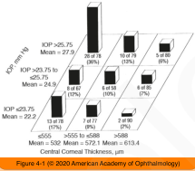

# 10.4.2. Open Angle Glaucoma (II): Open-Angle Glaucoma Without Elevated IOP

## Images

## Hierarchy

- Clinical features
  - glaucoma can develop at any IOP level within the range of pressures observed in the general population
    - IOP is a continuous risk factor for the development of glaucoma!
  - prevalence of normal-tension glaucoma appears to vary among different populations
    - among Japanese patients, a particularly high proportion of OAG occurs with IOP in the normal range
  - risk factors other than IOP may play a more important role in normal-tension glaucoma
    - local vascular factors may have a significant part
    - vasospastic disorders
      - migraine headache
      - Raynaud phenomenon
    - ischemic vascular diseases
    - vascular autoregulatory defects
    - coagulopathies
    - autoimmune diseases
  - bilateral but often asymmetric
    - worse damage usually occurs in the eye with the higher IOP
  - optic disc hemorrhages are more common
  - 2 groups based on disc appearance
    - senile sclerotic group
      - shallow, pale sloping of the neuroretinal rim
      - older patients with vascular disease
    - focal ischemic group
      - deep, focal notching of the neuroretinal rim
  - visual field defects in normal-tension glaucoma tend to be
    - more focal
    - deeper
      - dense paracentral scotoma encroaching on fixation is not an unusual finding as the initial defect
    - closer to fixation
  - there is no characteristic abnormality of the optic disc or visual field that distinguishes normal-tension glaucoma from POAG with higher IOPs
- Differential Diagnosis
  - See Table 4-1
  - management of normal-tension glaucoma and low CCT
    - 1) determine the baseline IOP
    - 2) Aim for target pressure 30% below baseline
- Ocular Hypertension (OHT)
  - definition
    - IOP is elevated above an arbitrary cutoff value, typically 21 mm Hg, in the absence of optic disc, retinal nerve fiber layer, or visual field abnormalities
      - even among individuals with elevated IOP, the majority never develop glaucoma
      - the higher the baseline IOP, the greater the risk of developing glaucoma
  - prevalence of OHT may be as high as 8x that of definite POAG
  - there is no clear consensus about whether elevated IOP should be treated in the absence of signs of early damage
    - treat those individuals thought to be at greatest risk of developing glaucoma
  - OHTS
    - patients 40–80 years of age with IOP 24-32 mm Hg were randomized to observation or to the reduction of IOP by topical medications
    - 5-year risk of progressing to glaucoma
      - with topical glaucoma medication
        - 4.4%
      - untreated
        - 9.5%
          - 22.5% decrease in IOP
    - most untreated patients did not get worse over a 5-year period
    - topical medications reduced the risk of progression to glaucoma in patients with OHT
    - each millimeter of mercury of elevated baseline IOP increased the risk of glaucomatous change by 10%
    - each 0.1 increment in vertical cup–disc ratio increased the risk by 32%
    - risk factors for the development of POAG
      - older age
      - higher IOP
      - lower CCT
        - increased risk of progression attributed to lower CCT in OHTS was not fully explained by the estimated artifactual error in measured IOP
          - lower CCT may be a marker for other susceptibility factors
      - higher pattern standard deviation on standard automated perimetry
      - higher cup–disc ratio at baseline
    - risk factors NOT confirmed in OHTS to be significant
      - myopia
      - diabetes mellitus
      - migraine
      - positive family history
      - high or low blood pressure
      - black race
        - significant in the univariate but not multivariate analysis
  - treatment for OHT
    - the clinician and the patient can decide together whether this risk warrants the inconvenience, cost, and potential side effects of therapy
    - risks and morbidity of therapy should not exceed the risks of the disease
    - additional factors that may affect the decision to start ocular hypotensive therapy
      - desires of the patient
      - patient compliance and availability for follow- up visits
      - reliability of visual fields
      - ability to examine the optic disc
  - subjects in the OHTS control arm, after a median of 7.5 years of observation without treatment, received IOP-lowering therapy
  - the question remained whether delaying treatment was associated with poorer outcomes compared to early initiation of IOP- lowering therapy
    - progression at the conclusion of the median follow-up of 13 years
      - 16% in the initial-treatment group
      - 22% in the late-treatment group
      - there was no further divergence in the Kaplan- Meier curves after both groups received IOP- lowering treatment
  - clinicians may safely consider delaying the treatment of OHT, particularly among patients with a lower risk of conversion to glaucoma
- Diagnostic Evaluation
  - applanation tonometry at various times during the day
    - 30%–50% of POAG have IOP < 21 mm Hg on a single reading
  - gonioscopy should be performed to rule out
    - angle closure
    - angle recession
    - evidence of previous intraocular inflammation
    - pigment dispersion
  - stereoscopic disc evaluation is essential to rule out
    - optic nerve coloboma
    - optic disc drusen
    - physiologically enlarged cups
  - medical history
    - history of cardiovascular disease
    - history of low blood pressure caused by hemorrhage, myocardial infarction, or shock
      - visual field loss consistent with glaucoma has been noted after a decrease in blood pressure following a hypotensive crisis
    - previous episode of prolonged, elevated IOP, such as that related to the use of steroids
  - additional medical/neurological evaluation should be considered in the setting of atypical findings
    - unilateral disease
    - decreased central vision
    - dyschromatopsia
    - young age
    - presence of a relative afferent pupillary defect
    - neuroretinal rim pallor
    - visual field loss not consistent with the optic disc appearance
    - test for
      - anemia
      - carotid artery insufficiency
        - auscultation and palpation of the carotid arteries
        - noninvasive tests of carotid circulation
      - syphilis
      - certain vitamin deficiencies
      - temporal arteritis
      - compressive lesions
        - evaluation of the optic nerve and chiasm with CT or MRI
- The Glaucoma Suspect
  - types
    - optic nerve/nerve fiber layer defect suggestive of glaucoma in the absence of abnormal perimetry
      - enlarged cup–disc ratio
      - asymmetric cup–disc ratio
      - notching or narrowing of the neuroretinal rim
      - disc hemorrhage
      - suspicious alteration in the nerve fiber layer
    - visual field abnormality consistent with glaucoma in the absence of a corresponding glaucomatous optic disc abnormality
  - typically monitored for the development of glaucoma with periodic evaluation of the optic nerve, retinal nerve fiber layer, and visual field
    - short-wavelength automated perimetry (SWAP)
    - frequency-doubling technology (FDT) perimetry
    - pattern electroretinogram
      - if signs of optic nerve damage are present, the diagnosis of early POAG should be considered and treatment initiated
  - in uncertain cases, do not hesitate to closely monitor patients without therapy to confirm either initial findings or progressive change
- Prognosis and Therapy
  - Collaborative Normal-Tension Glaucoma Study (CNTGS)
    - lowering IOP by ≥30% reduced the 5-year risk of visual field progression from 35% to 12%
      - in 65%the glaucoma did not progress despite the lack of treatment
      - in 12% the disease progressed despite successful IOP reduction
    - rate of visual field progression was highly variable
    - treatment benefit was lower among patients with a baseline history of disc hemorrhage
    - treatment of normal-tension glaucoma is generally initiated unless the optic neuropathy is determined to be stable
  - achieve an IOP level that is approximately 30% below a carefully determined baseline
  - adjust target pressure based on
    - baseline severity of the optic nerve damage
    - risks of therapy
    - life expectancy
    - comorbid conditions
  - topical medical therapy
    - most common initial approach
    - some glaucoma medications may have neuroprotective properties or may improve ocular circulation
    - in EMGT, betaxolol + argon laser trabeculoplasty (ALT) had little pressure- lowering effect on eyes with baseline IOPs ≤15 mm Hg
      - in such eyes incisional surgery and medications other than β-blockers are more likely to be beneficial
  - laser trabeculoplasty
  - glaucoma filtering surgery
    - ± antifibrotic agent
      - considered less effective for normal-tension glaucoma
      - mitomycin C or 5-fluorouracil,
