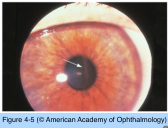
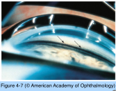
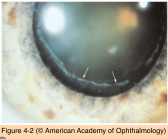
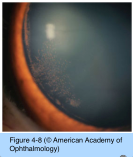
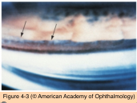
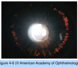
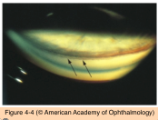
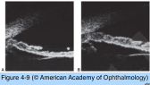

# 10.4.3. Open Angle Glaucoma (III): Secondary Open-Angle Glaucoma (I)

## Images

## Hierarchy

- Pigment Dispersion Syndrome/Pigmentary Glaucoma
  - pigment deposition on
    - corneal endothelium in a vertical spindle pattern (Krukenberg spindle)
      - caused by aqueous convection currents
        - phagocytosis of pigment by corneal endothelium
      - presence of Krukenberg spindle is not absolutely necessary to make the diagnosis of pigment dispersion syndrome
      - may occur in other diseases, such as exfoliation syndrome
    - trabecular meshwork
      - PXF can also show TM pigmentation
      - homogeneous, densely pigmented trabecular meshwork
      - Sampaolesi line
        - similar to PXF
        - speckled pigment at or anterior to the Schwalbe line
    - lens capsule near the equator of the lens
      - Zentmayer line
    - zonular fibers
    - anterior hyaloid
  - in PXF TI defects are at the pupillary margin
  - spokelike transillumination defects in the iris midperiphery
    - in front of the lens zonular fibers
  - posterior bowing of the iris
    - “reverse pupillary block” configuration
    - results in greater contact of the zonular fibers with the posterior iris surface
  - PXF presents later (>50 years)
  - pigmentary glaucoma
    - risk of glaucoma is ≈25%–50%
    - white males; 20-50 years
    - myopia
    - wide fluctuations in IOP
      - can exceed 50 mm Hg in untreated eyes
      - high IOP occurs when pigment is released into the aqueous humor, such as following exercise or pupillary dilation
    - symptoms
      - similar to PXF
      - intermittent visual blurring
      - halos
      - ocular pain
  - treatment
    - laser iridotomy
      - effectiveness has not been established
    - medical treatment
      - often successful in reducing the IOP
    - laser trabeculoplasty
      - effect may be short-lived
      - heavy trabecular pigmentation allows increased absorption of laser energy, in turn allowing lower energy levels for trabeculoplasty
      - spikes in IOP may be seen more frequently with higher energy settings
    - filtering surgery
      - usually successful
      - young patients with myopia may be at increased risk of hypotony maculopathy
  - natural course
    - with age, the signs and symptoms of pigment dispersion may decrease
      - normal growth of the lens
        - increase in physiologic pupillary block, moving the iris forward
      - the deposited pigment may fade
      - transillumination defects may also gradually disappear
- Exfoliation Syndrome (PXF)
  - genetics
    - LOXL1 mutation
      - in nearly all cases of exfoliation syndrome/ exfoliation glaucoma
      - also common in the population without glaucoma
        - PXF is multifactorial
      - causes reduced/abnormal synthesis of elastin fibers
        - elastin is an important component of the lamina cribrosa
          - PXF may increase the susceptibility of the optic nerve to injury
            - PXF is a risk factor for the conversion of OHT to glaucoma and for progression of OAG
  - histology
    - fibrillar material in and on the lens epithelium and capsule, pupillary margin, ciliary epithelium, iris pigment epithelium, iris stroma, iris blood vessels, and subconjunctival tissue (and other parts of the body)
  - unilateral or bilateral
    - often the disorder is clinically apparent in only 1 eye
      - the uninvolved fellow eye often develops the syndrome at a later time
        - varying degrees of asymmetry
  - strongly age-related
    - most commonly >70 years
    - rarely seen <50 years
  - deposition of a distinctive fibrillar material in the anterior segment of the eye
    - deposits occur in a targetlike pattern on the anterior lens capsule
      - best seen after pupillary dilation
      - central area and a peripheral zone of deposition are usually separated by an intermediate clear area
    - material is often visible on
      - iris
      - edge of the pupil
      - zonular fibers
      - ciliary processes
      - inferior anterior chamber angle
      - corneal endothelium
      - anterior hyaloid
        - in aphakic individuals
  - Sampaolesi line
    - scalloped inferior pigmented deposition anterior to the Schwalbe line
  - peripupillary atrophy
    - transillumination of the pupillary margin
    - transillumination defects over the entire sphincter region
  - zonular weakness
    - phacodonesis
    - iridodonesis
    - zonular dehiscence, vitreous loss, and lens dislocation during and after cataract surgery
    - anterior movement of the lens–iris interface
      - narrow anterior chamber angle
  - trabecular meshwork
    - heavily pigmented with brown pigment
      - variegated fashion
  - fine pigment deposits on the iris surface
    - +- Krukenberg spindle
  - pupil often dilates poorly
  - iris angiography
    - abnormalities of the iris vessels with fluorescein leakage
  - exfoliation glaucoma
    - fibrillar material obstructs flow through and causes damage to the trabecular meshwork or the uveoscleral pathway
    - odds of PXF leading to glaucoma
      - ≤40% over a 10-year period
    - in Scandinavian countries, PXF accounts for >50% of OAG
    - exfoliation glaucoma differs from POAG in
      - unilateral presentation
      - greater pigmentation of the trabecular meshwork
      - higher IOP
      - greater diurnal fluctuations
      - overall worse prognosis
    - laser trabeculoplasty
      - can be very effective
      - response in exfoliation glaucoma may not last as long as that in POAG
    - LOXL1 mutation
