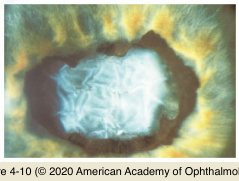
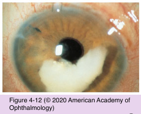
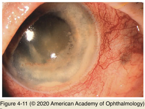

# 10.4.4. Open Angle Glaucoma (IV): Secondary Open-Angle Glaucoma (II): Lens-Induced Glaucoma

## Images

## Hierarchy

- Lens particle glaucoma
  - lens cortex particles obstruct the trabecular meshwork
  - following
    - cataract extraction
    - capsulotomy
    - ocular trauma
  - severity of IOP elevation depends on
    - quantity of lens material released
    - degree of inflammation
    - ability of the trabecular meshwork to clear the lens material
    - functional status of the ciliary body
  - clinical findings
    - within weeks of the initial surgery or trauma
      - ± months or years later
    - free cortical material in the anterior chamber
    - elevated IOP
    - moderate anterior chamber reaction
    - microcystic corneal edema
    - posterior synechiae and peripheral anterior synechiae
  - treatment
    - medications to decrease aqueous formation
    - mydriatics to inhibit posterior synechiae formation
    - topical corticosteroids to reduce inflammation
    - If IOP cannot be controlled, surgical removal of the lens material is necessary
- Phacolytic glaucoma
  - mature or hypermature cataract
    - leakage of lens protein through microscopic openings in the lens capsule
      - obstruction of TM by
        - lens proteins
        - phagocytizing macrophages
        - other inflammatory debris
  - lens aging
    - increased concentration of high-molecular- weight lens protein
  - clinical presentation
    - elderly patient with a history of poor vision
    - sudden onset of pain, conjunctival hyperemia, and worsening vision
    - markedly elevated IOP
    - microcystic corneal edema
    - prominent cell and flare reaction
      - cellular debris in the anterior chamber angle
      - ± pseudohypopyon
    - large white particles (clumps of lens protein) may also be seen in the anterior chamber
    - open anterior chamber angle
  - treatment
    - medications to control the IOP
    - definitive therapy requires cataract extraction
- NO keratic precipitates (KP)
  - helps distinguish phacolytic glaucoma from phacoantigenic glaucoma
- Phacoantigenic glaucoma
  - rare
  - pathogenesis
    - following surgery or penetrating trauma
    - sensitization to lens protein
  - clinical presentation
    - granulomatous inflammation
    - moderate anterior chamber reaction
    - KP on both the corneal endothelium and the anterior lens surface
    - low-grade vitritis
      - differentiates from phacolytic glaucoma
    - synechial formation
    - residual lens material in the anterior chamber
    - glaucomatous optic neuropathy
      - not common
  - treatment
    - corticosteroids and aqueous suppressants
    - removal of residual lens material
      - If medical treatment is unsuccessful
