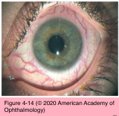
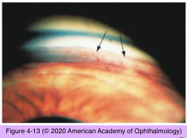

# 10.4.5. Open Angle Glaucoma (V): Secondary Open-Angle Glaucoma (III)

## Images

## Hierarchy

- Intraocular Tumors
  - unilateral chronic glaucoma
  - pathogenesis
    - open-angle
      - direct tumor invasion of the anterior chamber angle
      - deposition of tumor cells, tumor-filled macrophages, inflammatory cells, and cellular debris within the trabecular meshwork
      - intraocular hemorrhage
    - angle-closure
      - rotation of ciliary body or anterior displacement of the lens–iris interface
      - neovascularization of the angle
      - pupillary block glaucoma caused by posterior synechiae
  - tumor types
    - adults
      - uveal melanoma
      - metastatic carcinoma
      - lymphomas
      - leukemia
    - children
      - retinoblastoma
      - juvenile xanthogranuloma
      - medulloepithelioma
- Elevated Episcleral Venous Pressure
  - See Table 4-3
  - normal episcleral venous pressure
    - 8–10 mm Hg
  - etiology
    - head trauma
    - most cases are idiopathic
      - ± familial
  - clinical presentation
    - unilateral or bilateral
    - chronic red eye without discomfort or allergic symptoms
    - tortuous, dilated episcleral veins
    - signs of ocular ischemia or venous stasis
    - gonioscopy
      - blood in the Schlemm canal
    - sudden, severe carotid-cavernous fistulas
      - proptosis
      - other orbital or neurological signs
      - may require neuroradiologic intervention
  - treatment
    - prostaglandin analogues
    - aqueous humor suppressants
    - glaucoma filtering surgery
      - complicated by ciliochoroidal effusion or suprachoroidal hemorrhage
    - laser trabeculoplasty is not effective
- Inflammatory Glaucoma
  - pathogenesis
    - open-angle
      - trabecular meshwork edema
      - trabecular meshwork endothelial cell dysfunction
      - trabecular meshwork blockage by fibrin and inflammatory cells
      - blockage of the Schlemm canal by inflammatory cells
      - prostaglandin-mediated breakdown of the blood–aqueous barrier
      - steroid-induced glaucoma
        - reducing inflammation and improving aqueous production
        - decreasing outflow through the trabecular meshwork
    - angle-closure
      - peripheral anterior synechiae
      - posterior synechiae with iris bombé
  - uveitides commonly associated with open- angle inflammatory glaucoma
    - Fuchs heterochromic iridocyclitis
    - herpes zoster iridocyclitis
    - herpes simplex keratouveitis
    - toxoplasmosis
    - juvenile idiopathic arthritis
    - pars planitis
  - miotic agents should be avoided in patients with iritis
    - ± aggravate inflammation
    - ± cause posterior synechiae
  - prostaglandin analogues
    - studies have demonstrated their ocular hypotensive efficacy in eyes with anterior uveitis
    - ± exacerbate inflammation in some eyes with uveitis and herpetic keratitis
  - inadequately controlled inflammation with elevated IOP is often mistaken for steroid- induced glaucoma
    - presence of KP suggests iritis as the cause of IOP elevation
      - gonioscopy may reveal subtle trabecular meshwork precipitates
    - in the face of active inflammation, elevated IOP should be presumed to be inflammation- related rather than steroid-induced
- Fuchs heterochromic iridocyclitis
  - epidemiology
    - relatively rare
    - middle-aged men and women
    - rubella virus infection may be the underlying cause
  - clinical presentation
    - chronic
    - unilateral
    - loss of iris pigment
      - iris hypochromia
        - glaucomatocyclitic crisis (Posner-Schlossman syndrome) may be caused by herpes simplex virus
        - in patients with blue irides, the affected eye may appear hyperchromic
    - low-grade anterior chamber reaction
    - small, stellate, pancorneal KP
    - posterior subcapsular cataracts
    - gonioscopy
      - multiple fine vessels that cross the trabecular meshwork
        - not associated with fibrous membrane and do not lead to PAS and secondary angle closure
        - fragile and may cause an anterior chamber hemorrhage
          - spontaneously or with trauma, including cataract or glaucoma surgery
    - secondary OAG
      - 15%
      - IOP does not correspond to degree of inflammation
  - treatment
    - corticosteroids
      - generally not effective
      - could potentially cause a steroid-induced IOP elevation
    - OAG may be difficult to control
      - aqueous suppressants
- Glaucomatocyclitic crisis (Posner- Schlossman syndrome)
  - epidemiology
    - uncommon
    - middle-aged patients
  - etiology
    - unknown
    - infection with herpes simplex virus has been implicated
  - open-angle inflammatory glaucoma
    - recurrent bouts of markedly increased IOP and low-grade anterior chamber inflammation
  - symptoms
    - unilateral
    - blurred vision
    - mild eye pain
  - clinical presentation
    - mild iritis
    - few KP that are small, discrete, and round
      - usually resolve spontaneously within a few weeks
      - may be seen on the trabecular meshwork
        - “trabeculitis”
    - markedly elevated IOP
      - 40–50 mm Hg range
      - in between bouts, the IOP usually returns to normal
        - with increasing numbers of attacks, a chronic secondary glaucoma may develop
    - ± corneal edema
  - prevention
    - no evidence that long-term suppressive therapy with topical nonsteroidal anti- inflammatory agents or mild steroids is effective
  - differential diagnosis
    - recurrent attacks of acute angle-closure glaucoma
    - cytomegalovirus
      - distinguishing glaucomatocyclitic crisis from cytomegalovirus is important, because specific antiviral therapy for cytomegalovirus is available
