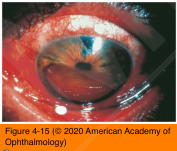
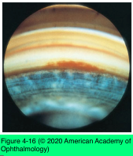
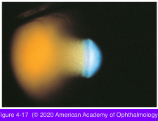

# 10.4.6. Open Angle Glaucoma (VI): Secondary Open-Angle Glaucoma (IV): Accidental and Surgical Trauma (I)

## Images

## Hierarchy

- Introduction
  - blunt trauma
    - anterior segment injuriers
      - hyphema
      - angle recession
      - iridodialysis
      - iris sphincter tear
      - cyclodialysis
      - lens subluxation
    - pathogenesis
      - posttraumatic inflammation
      - blood
      - direct injury to the trabecular meshwork
    - usually short in duration but may be protracted
    - risk of
      - corneal blood staining
      - glaucomatous optic nerve damage
  - penetrating or perforating injuries
    - siderosis
    - chalcosis
    - OAG
  - chemical injuries, particularly alkali
    - acute secondary glaucoma
      - inflammation
      - shrinkage of scleral collagen
      - release of chemical mediators such as prostaglandins
      - direct damage to the chamber angle/ trabecular meshwork
        - may cause glaucoma to develop months or years after a chemical injury
      - compromise of the anterior uveal circulation
- Hemolytic and ghost cell glaucoma
  - develop after a vitreous hemorrhage
  - hemolytic glaucoma
    - hemoglobin-laden macrophages block the trabecular meshwork
      - reddish brown discoloration of the trabecular meshwork
    - red-tinged cells float in the anterior chamber
  - ghost cell glaucoma
    - ghost cells block the trabecular meshwork
    - ghost cells
      - RBCs that have lost their intracellular hemoglobin and appear as small, khaki- colored cells
      - develop within 1–3 months of a vitreous hemorrhage
      - enter anterior chamber through disrupted hyaloid face
        - previous surgery (pars plana vitrectomy, cataract extraction, or capsulotomy)
        - trauma
        - spontaneously
      - less pliable than normal RBCs
    - clinical presentation
      - long-standing vitreous hemorrhage
        - characteristic khaki coloration
      - IOP may be markedly elevated, causing corneal edema
      - anterior chamber is filled with small, circulating, tan-colored cells
      - cellular reaction appears out of proportion to the aqueous flare
      - conjunctiva tends not to be inflamed (unless the IOP is markedly elevated)
      - angle appears normal except for the layering of ghost cells over the trabecular meshwork inferiorly
  - management
    - both hemolytic and ghost cell glaucoma generally resolve once the hemorrhage has cleared
    - aqueous suppressants
      - preferred initial approach
    - irrigation of the anterior chamber
    - pars plana vitrectomy
    - incisional glaucoma surgery
- Hyphema
  - pathogenesis
    - obstruction of the trabecular meshwork with
      - red blood cells (RBCs)
      - inflammatory cells
      - debris
      - fibrin
    - direct injury to the trabecular meshwork from the blunt trauma
  - increased IOP is more common following recurrent hemorrhage/rebleeding
    - frequency of rebleeding following hyphema
      - 5%–10%
    - usually within 3–7 days
    - normal clot retraction and lysis
  - sickle cell hemoglobinopathies
    - increased incidence of elevated IOP following hyphema
      - RBCs tend to sickle in the anterior chamber, because of the low pH of aqueous humor
        - more rigid cells become trapped in the trabecular meshwork
    - increased susceptibility to development of optic neuropathy
      - optic nerves of patients with sickle cell disease are much more sensitive to elevated IOP
        - anterior ischemic optic neuropathy
        - central retinal artery occlusion
  - management
    - uncomplicated hyphema
      - eye shield
      - limited activity
      - head elevation
    - systemic aminocaproic acid
      - reduces rebleeding in some studies
        - not confirmed in all studies
      - systemic adverse effects
        - hypotension
        - syncope
        - abdominal pain
        - nausea
        - discontinuation of aminocaproic acid may be associated with clot lysis and with additional IOP elevation
    - topical and systemic corticosteroids
      - reduce associated inflammation
      - effect on rebleeding is debatable
    - cycloplegic agents
      - If significant ciliary spasm or photophobia
      - no proven benefit for prevention of rebleeding
    - patching and bed rest are advocated by some authors
      - unproven value
    - elevated IOP
      - aqueous suppressants
      - hyperosmotic agents
      - patients with sickle cell hemoglobinopathies should avoid carbonic anhydrase inhibitors
        - increase the sickling tendency in the anterior chamber by further lowering the pH
