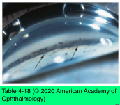
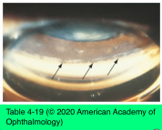

# 10.4.7. Open Angle Glaucoma (VII): Secondary Open-Angle Glaucoma (V): Accidental and Surgical Trauma (II)

## Images

## Hierarchy

- Glaucoma and penetrating keratoplasty
  - increased frequency of elevated IOP
    - aphakic/pseudophakic patients
    - second graft
  - mechanism
    - wound distortion of the trabecular meshwork
    - progressive angle closure
  - alternative procedures may be associated with a lower rate of elevated IOP
    - lamellar stromal or endothelial grafts
- Surgical trauma
  - mechanism
    - pigment release
    - inflammatory cells
    - RBCs
    - debris
    - mechanical deformation of the trabecular meshwork
    - angle closure
    - agents used as adjuncts to intraocular surgery
      - dispersive viscoelastics (especially higher- molecular-weight forms)> cohesive viscoelastics
  - can cause considerable damage to the optic nerve of a susceptible individual, even in a short time
    - eyes with preexisting glaucoma!
  - can increase the risk of retinal and optic nerve ischemia
  - implantation of an intraocular lens (IOL) can lead to secondary glaucoma
    - uveitis-glaucoma-hyphema (UGH) syndrome
      - chronic irritation caused by
        - anterior chamber IOL
        - posterior chamber IOL
        - suture-fixated IOL
        - chafing of the iris by the IOL/erosion of the lens haptics through the iris or ciliary body
      - clinical presentation
        - chronic inflammation
          - cystoid macular edema
          - secondary iris neovascularization
        - intractable glaucoma
        - recurrent hyphemas
      - diagnostic tests
        - gonioscopy
        - ultrasound biomicroscopy
          - reveal the IOL’s exact relation to the iris and ciliary body
      - differential diagnosis
        - neovascularization of the internal lip of a corneoscleral wound
          - recurrent spontaneous hyphemas
          - elevated IOP
          - argon laser ablation of the vessels
      - management
        - persistent or recurrent cases often require lens repositioning or lens exchange
    - secondary pigmentary glaucoma
    - pseudophakic pupillary block
  - management
    - measure IOP soon after surgery or laser treatment
    - β-adrenergic antagonists
    - α2-adrenergic agonists
    - carbonic anhydrase inhibitors
    - hyperosmotic agents
    - paracentesis
    - filtering surgery
      - for persistent elevation of IOP
- Traumatic, or angle-recession, glaucoma
  - angle-recession
    - tear in the ciliary body between the longitudinal and circular muscle fibers
    - associated with injury to the trabecular meshwork
  - classic gonioscopic findings
    - brown-colored, broad angle recess
    - absent or torn iris processes
    - white, glistening scleral spur
    - depression in the overlying trabecular meshwork
    - PAS at the border of the recession
  - findings consistent with previous trauma
    - corneal scars
    - iris injury
    - changes in the angle as mentioned previously
      - comparing gonioscopic findings in the affected eye with those in the fellow eye
    - focal anterior subcapsular cataracts
    - phacodonesis
  - chronic
  - unilateral
  - glaucoma may occur soon after trauma or months to years later
    - risk decreases appreciably after several years
      - still present ≥25 years following injury
  - not possible to predict which eyes will develop glaucoma
    - greater extent of angle recession is associated with a greater risk of glaucoma
    - even with substantial angle recession, this risk is not high
    - all eyes with angle recession must be examined annually
  - up to 50% of fellow eyes may develop elevated IOP
  - treatment
    - aqueous suppressants
    - prostaglandin analogues
    - α2-adrenergic agonists
    - miotics
      - may be useful
      - paradoxical responses with increased IOP may occur
    - laser trabeculoplasty
      - limited role
    - incisional glaucoma surgery
