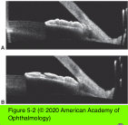
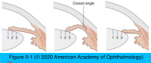

# 10.5.1. Angle-Closure Glaucoma (I): Primary Angle Closure (I)

## Images

## Hierarchy

- Introduction to ACG
  - 67 million patients with glaucoma worldwide
    - one-half are of Asian descent
  - prevalence of angle-closure glaucoma (ACG) is higher than that of other types of glaucoma among Asians
  - ratio of OAG to ACG in Chinese individuals ranges from 1:1 to 2.6:1
    - PACG is responsible for 91% of the bilateral blindness in China
  - pathogenesis
    - primary pathology is anatomical, proximal to the trabecular meshwork
    - peripheral iris impedes the access of aqueous to the trabecular meshwork
  - onset
    - acute ACG (20%–30%)
    - chronic ACG (70%–80%)
  - 2 main categories
    - primary
      - no identifiable underlying pathology
      - only an anatomical predisposition to pupillary block
      - rare <40 years
    - secondary
      - an identifiable pathologic cause initiates the angle closure
- Pathogenesis and Pathophysiology of Angle Closure
  - apposition or adhesion of the peripheral iris to the trabecular meshwork
    - appositional
      - transient and intermittent
    - synechial
      - permanent
  - 2 mechanisms
    - mechanisms that push the iris forward from behind
    - mechanisms that pull the iris forward
    - See Table 5-1
    - dynamic changes in iris volume and water content
      - most eyes show a loss of iris volume with dilation of the pupil
      - eyes at risk for angle closure may have less ability to rid the iris stroma of water upon dilation
  - pupillary block
    - most frequent cause of angle closure
    - flow of aqueous from the posterior chamber through the pupil is impeded at the level of the lens–iris interface
      - pressure gradient between posterior and anterior chambers
        - peripheral iris bows forward against the trabecular meshwork
    - PACG results from anatomical factors at the lens–iris interface
      - iris contact with
        - lens
        - intraocular lens
        - capsular remnants
        - anterior hyaloid
        - vitreous space–occupying substance (air, silicone oil)
    - maximal when the pupil is in mid-dilated position
    - secluded pupil
      - absolute pupillary block as a result of 360° of posterior synechiae
    - may be broken by an unobstructed peripheral iridectomy
  - angle closure without pupillary block
    - iris and/or lens being pushed, rotated, or pulled forward
  - lens-induced angle-closure glaucoma
    - increased pupillary block caused by
      - intumescent lens (phacomorphic glaucoma)
      - dislocated/subluxated lens
      - lens block
        - zonular laxity
          - allows the lens to move forward
          - prone position may aggravate the tendency of the lens to move forward
  - iris-induced angle closure
    - peripheral iris, either directly or indirectly, is the cause of the iridotrabecular apposition
    - developmental anomalies
      - anterior cleavage abnormalities
        - iris insertion is more anterior into the scleral spur or meshwork
    - thick peripheral iris
      - on dilatation “rolls” into the trabecular meshwork
    - anteriorly displaced ciliary processes
      - secondarily rotate the peripheral iris forward into the meshwork (plateau iris)
    - aniridia
      - rudimentary iris leaflets rotate into the angle
- Acute Primary Angle Closure
  - symptoms
    - ocular pain
    - headache
    - blurred vision
    - rainbow-colored halos around lights
    - nausea and vomiting
  - signs
    - high IOP
    - mid-dilated, sluggish, and irregularly shaped pupil
    - corneal epithelial edema
    - congested episcleral and conjunctival blood vessels
    - shallow anterior chamber
    - mild amount of aqueous flare and cells
  - definitive diagnosis
    - gonioscopy
      - dynamic gonioscopy
        - appositional closure vs. synechial closure
        - may also be therapeutic in breaking the attack of acute angle closure
      - clearing of corneal edema with medical treatment of elevated IOP or topical glycerin may be necessary
      - pupillary constriction stimulated by the slit- lamp beam may open the angle and the narrow recess may go unrecognized
      - gonioscopy of the fellow eye reveals a narrow, occludable angle
        - presence of a deep angle in the fellow eye should alert the clinician to alternative causes of elevated IOP
  - complications
    - glaucomatous optic nerve damage
    - ischemic nerve damage
    - retinal vascular occlusion
    - PAS can form rapidly
    - IOP-induced iris ischemia
      - sector atrophy of the iris
      - pigment release from the iris
        - pigmentary dusting of the iris surface and corneal endothelium
      - iris sphincter muscle ischemia
        - permanently fixed and dilated pupil
    - Glaukomflecken
      - small anterior subcapsular lens opacities
  - treatment
    - treatment modalities
      - laser iridotomy
        - treatment of choice
      - when laser iridotomy cannot be accomplished
        - surgical iridectomy
          - less commonly
        - lensectomy
          - with or without goniosynechialysis
        - laser iridoplasty
          - flattens the peripheral iris
        - laser pupilloplasty
          - relieves pupillary block
      - cholinergic agents (pilocarpine 1%–2%)
        - mild attacks
        - pupillary sphincter may be ischemic and unresponsive to miotic agents if IOP >40–50 mm Hg
        - stronger miotics should be avoided
          - increase the vascular congestion of the iris or rotate the lens–iris interface more anteriorly
      - other IOP lowering medications
        - avoid
          - nonselective adrenergic agonists
            - cause pupillary dilation and iris ischemia
          - medications with significant α1-adrenergic activity (apraclonidine)
            - cause pupillary dilation and iris ischemia
        - β-adrenergic antagonists
        - α2-adrenergic agonists
        - prostaglandin analogues
        - oral, topical, or intravenous carbonic anhydrase inhibitors
      - hyperosmotic agent
        - orally or intravenously
      - paracentesis
        - 30-gauge needle
        - reduce the IOP to enable the miotic agent to constrict the pupil and break the block
      - globe compression
      - dynamic gonioscopy
    - improved IOP does not necessarily mean that the angle has opened
      - ciliary body ischemia causes reduced aqueous production
        - IOP may remain low for weeks following acute angle closure
      - reevaluate the angle by gonioscopy!
        - to assess the degree of residual synechial angle closure
        - confirm the reopening of at least part of the angle
    - the fellow eye is at high risk of developing acute angle closure
      - especially if the inciting mechanism included systemic sympathomimetic agent (e.g. nasal decongestant) or an anticholinergic agent
      - pain and emotional upset from the involvement of the first eye may increase sympathetic flow to the fellow eye
      - perform peripheral iridotomyin the other eye if a similar angle configuration is present
      - if the contralateral eye has a significantly different angle configuration, secondary ACGs must be strongly considered
        - posterior segment mass
        - zonular insufficiency
        - iridocorneal endothelial (ICE) syndrome
- Risk Factors for Developing Primary Angle Closure
  - race
    - prevalence of PACG in patients >40 years
      - 0.1%–0.6% in whites
      - 0.1%–0.2% in blacks
      - 2.1%–5.0% in the Inuit
      - 0.4%–1.4% in East Asians
        - cannot be explained by biometric parameters alone
        - the burden of ACG is greater in asian countries
      - 0.3% in the Japanese
      - 2.3% in a mixed ethnic group in South Africa
    - most angle closure presents as an asymptomatic chronic disease without an acute attack
    - references
  - ocular biometrics
    - small, “crowded” anterior segments
    - shallow anterior chamber
      - anterior chamber depth (ACD) <2.5 mm
        - most patients with PACG have ACD <2.1 mm
      - strong correlation of increasing PAS formation with ACD <2.4 mm
      - angle closure still occurs with deep anterior chambers
    - thick lens
      - prevalence of ACG increases with each decade after 40 years of age
        - increasing thickness and forward movement of the lens with aging
    - increased anterior curvature of the lens
    - short axial length (AL)
    - small corneal diameter and radius of curvature
    - references
  - gender
    - 2-4 x more common in women
      - have smaller anterior segments and ALs
        - not enough to explain this gender predilection
  - family history
    - incidence increased in first-degree relatives of affected individuals
      - Whites
        - 1%-12%
      - Chinese
        - 6 x greater risk
      - Inuit
        - 3.5 x greater risk
    - genetic influence in ACG
  - refraction
    - hyperopia
    - ACG in a patient with significant myopia should alert the clinician to secondary mechanisms
      - microspherophakia
      - plateau iris configuration
      - phacomorphic closure
