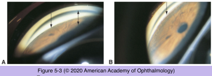

# 10.5.2. Angle-Closure Glaucoma (II): Primary Angle Closure (II)

## Images

## Hierarchy

- Subacute or Intermittent Angle Closure
  - episodes of blurred vision, halos, and mild pain caused by elevated IOP
    - periodically over days, months, or years
    - symptoms resolve spontaneously
      - during sleep-induced miosis
    - may occur in the absence of symptoms
    - often confused with headaches or migraines
  - IOP is usually normal between the episodes
  - gonioscopy
    - narrow chamber angle ± PAS
  - treatment
    - laser iridotomy
      - treatment of choice
    - lensectomy
      - if significant lens opacity is present
      - ± goniosynechialysis
        - in cases of significant synechial closure
  - clinical course
    - can progress to
      - chronic angle closure
      - acute attack that does not resolve spontaneously
- Chronic Angle Closure
  - pathogenesis
    - acute angle closure in which synechial closure persists
      - most common
    - gradual asymptomatic angle closure
      - chamber angle closes gradually and IOP rises slowly
        - "creeping angle closure"
      - tends to be diagnosed in its later stages
      - a major cause of blindness in Asia
      - mechanisms
        - pupillary block
        - abnormalities in iris thickness and position
        - plateau iris configuration
  - clinical presentation
    - resembles and is confused with chronic OAG
      - gonioscopic examination of all glaucoma patients is important
    - IOP can rise precipitously and become more difficult to control
    - dynamic gonioscopy
      - permanent PAS
  - management
    - iridectomy is necessary
      - without iridectomy, closure of the angle usually progresses
      - even with a patent peripheral iridectomy, progressive angle closure can occur
        - periodic gonioscopy is imperative
      - iridectomy with or without long-term use of ocular hypotensive medication will control the disease in most patients
    - iridoplasty
    - lensectomy with or without goniosynechialysis
    - filtering surgery
- The Occludable/Narrow Anterior Chamber Angle
  - only a small % of patients with shallow anterior chambers develop ACG
    - gonioscopy has relatively poor predictive value
    - provocative tests
      - designed to precipitate a limited form of angle closure
      - types
        - pharmacologic pupillary dilation
        - darkroom prone-position
      - positive test result
        - IOP increase of ≥8 mm Hg
        - asymmetric pressure rise between the 2 eyes with a corresponding degree of angle closure
          - gonioscopic evidence of appositional angle closure in at least a portion of the angle
      - provocative testing has not been validated in a prospective study
    - iridotomy is not necessary in all patients with a suspicious or borderline narrow angle
    - any patient with narrow angles, regardless of the results of provocative testing, should be advised of
      - symptoms of angle closure
    - decision to treat an asymptomatic patient with narrow angles rests on clinical judgment
      - value of long-term periodic follow-up
  - relative indications for iridotomy in patients with narrow angle
    - appositional or near-appositional closure
    - PAS
    - increased segmental trabecular meshwork pigmentation
    - history of previous angle closure
    - positive provocative test result
    - ACD of less than 2.0 mm
      - strong family history of angle closure
    - status of the lens and the benefit of cataract surgery should also be considered
  - factors that cause pupillary dilation may induce angle closure
    - drugs
      - mydriatic agents
        - dilating drops
        - systemic medications
          - adrenergic (sympathomimetic)
          - anticholinergic (parasympatholytic)
          - examples
            - allergy and cold medications
            - antidepressants
      - miotic agents
        - strong miotics
          - cholinesterase inhibitors
            - some urological drugs
        - mechanism
          - relax zonular fibers of the lens, allowing the lens–iris interface to move forward
          - increase in the amount of iris–lens contact
        - gonioscopy should be repeated soon after miotic drugs are administered to patients with narrow angles
      - when such drugs are administered to patients with potentially occludable angles
        - inform the patient of the risk and symptms of angle closure
        - consider iridotomy
    - emotional upset
    - fright
    - pain
  - reversing pharmacologic dilation
    - α-receptor blockers
      - dapiprazole
      - thymoxamine
      - reduce the overall time that the pupil is dilated/ mid-dilated
        - do not eliminate the possibility of precipitating angle closure
- Plateau Iris
  - pathogenesis
    - atypical configuration of the anterior chamber angle
      - anteriorly positioned ciliary processes that critically narrow the anterior chamber recess
    - component of pupillary block is often present
      - more anterior junction of the iris dilator muscle and the ciliary epithelium
      - angle may be further compromised following dilation of the pupil
  - may result in acute or chronic ACG
    - PAS formation
      - plateau iris
        - anterior to posterior direction
          - begin at the Schwalbe line and extend in a posterior direction
      - pupillary block–induced angle closure
        - posterior to anterior direction
  - diagnosis
    - plateau iris should be suspected in an eye with angle closure if
      - central anterior chamber appears to be of normal depth
      - iris plane appears to be rather flat
    - should be confirmed with
      - gonioscopy
      - ultrasound biomicroscopy
        - “double hump” sign
  - management
    - laser iridotomy
      - remove any component of pupillary block
        - diagnosis will be missed if the examiner relies solely on the slit-lamp examination
    - lensectomy
      - if cataract is present
        - remain predisposed to angle closure despite a patent iridotomy
    - long-term miotic therapy
    - argon laser peripheral iridoplasty
      - to flatten and thin the peripheral iris
      - may be more useful
    - repeated gonioscopy at regular intervals is necessary because the threat of angle closure may remain
