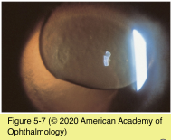
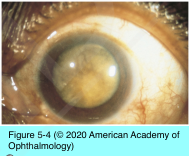
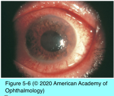
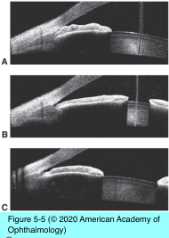

# 10.5.3. Angle-Closure Glaucoma (III): Lens-Induced Angle Closure

## Images

## Hierarchy

- Phacomorphic glaucoma
  - pathogenesis
    - mass effect of the cataractous lens
    - pupillary block
  - onset
    - narrowing of the angle generally occurs slowly
    - in some cases, the onset may be acute and rapid
      - precipitated by marked lens swelling (intumescence)
  - distinguishing between primary angle closure and phacomorphic angle closure is not always straightforward
    - disparities between the 2 eyes in ACD, gonioscopy, and degree of cataract should suggest a phacomorphic process
  - treatment
    - laser iridotomy followed by cataract extraction in a quiet eye
      - in many cases, the iridotomy is unnecessary
    - cholinergic agents
      - may further narrow the angle
      - miotic pupil will make subsequent cataract surgery more difficult
- Ectopia lentis
  - displacement of the lens from its normal anatomical position
  - forward displacement
    - pupillary block
      - shallowing of the anterior chamber angle
  - acute
    - pain, conjunctival hyperemia, and vision loss
  - chronic
    - PAS formation secondary to repeated attacks
  - See Table 5-2
  - Microspherophakia
    - lens has a spherical or globular shape
      - faulty development of secondary lens fibers
    - may cause ectopia lentis and subsequent pupillary block
      - secondary angle-closure glaucoma
        - miotics aggravate this condition
        - laser iridotomy
          - cycloplegics are the medical treatment of choice
    - high myopia
    - often familial
    - associated conditions
      - isolated
      - Weill-Marchesani syndrome
        - most common associated syndrome
        - autosomal recessive
        - small stature
        - short and stubby fingers
        - broad hands with reduced joint mobility
      - Lowe syndrome
        - oculocerebrorenal syndrome of Lowe
          - x-linked
          - systemic acidosis
          - renal rickets
          - hypotonia
          - congenital cataract
            - focal, internally directed excrescences of lens capsule
          - microspherophakia
      - Marfan syndrome
      - Peters anomaly
      - Alport syndrome
      - congenital rubella
    - treatment
      - 2 laser iridotomies 180° apart
      - definitive lensectomy, if indicated from a visual function standpoint
      - cycloplegia
        - tightens the zonules, flattens the lens, and pulls it posteriorly
        - miotics may make the condition worse
  - exfoliation syndrome
    - crystalline lens subluxation
      - most common form of acquired zonular insufficiency
- Aphakic or pseudophakic angle-closure glaucoma
  - intact vitreous face blocks the pupil and/or an iridectomy
    - aphakic or pseudophakic eyes
    - phakic eye with a dislocated lens
  - iris shows considerable bombé configuration
  - treatment
    - mydriatic and cycloplegic agents
      - restore the aqueous flow through the pupil
      - make laser iridotomy difficult initially
    - topical β-adrenergic antagonists
    - α2-adrenergic agonists
    - carbonic anhydrase inhibitors
    - hyperosmotic agents
    - ≥1 laser iridotomies
  - anterior chamber intraocular lenses
    - lens haptic or vitreous obstruct the iridectomy or the pupil
    - peripheral iris bows forward around the anterior chamber IOL
    - treatment
      - central chamber remains deep
      - laser iridotomies, often multiple
  - following posterior capsulotomy
    - vitreous obstructs the pupil
  - capsular block
    - retained viscoelastic or fluid in the capsular bag pushes a posterior chamber IOL anteriorly
