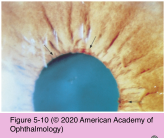
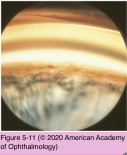
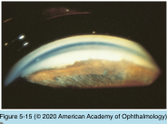
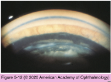
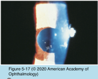
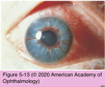
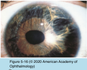
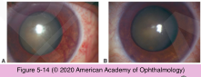

# 10.5.4. Angle-Closure Glaucoma (IV): Secondary Angle Closure Without Pupillary Block (I)

## Images

## Hierarchy

- 2 mechanisms
  - contraction of an inflammatory, hemorrhagic, or vascular membrane, band, or exudate in the angle, leading to PAS
  - forward displacement of the lens–iris interface, often accompanied by swelling and anterior rotation of the ciliary body
- F>M
- unilateral
- Neovascular Glaucoma
  - etiology
    - See Table 5-3
    - most common causes
      - diabetic retinopathy
      - central retinal vein occlusion
      - ocular ischemic syndrome
    - may occur without demonstrable retinal ischemia
      - Fuchs heterochromic iridocyclitis
      - other types of uveitis
      - exfoliation syndrome
    - when an ocular cause cannot be found
      - carotid artery occlusive disease
        - isolated iris melanomas
  - clinical presentation
    - fine arborizing blood vessels on the surface of the iris, pupil margin, and trabecular meshwork
      - distinguish dilated iris vessels associated with inflammation from newly formed abnormal blood vessels
    - presents in a classic pattern
      - starts with fine vascular tufts at the pupillary margin
      - extend radially over the iris
      - fine single vessels branch as they reach and involve the trabecular meshwork
        - angle neovascularization can occur without iris neovascularization
          - 10% of CRVO patients develop angle neovascularization alone
        - trabecular meshwork takes on a reddish coloration
      - accompanying fibrous membrane typically does not grow over healthy corneal endothelium
        - PAS end at the Schwalbe line
    - high IOP
      - acute or subacute glaucoma
    - reduced vision
    - pain
    - conjunctival hyperemia
    - microcystic corneal edema
    - gonioscopy
      - use a bright slit-lamp beam of light and high magnification
  - management
    - panretinal photocoagulation
      - treatment of choice when the ocular media are clear
      - decrease in neovascularization after panretinal photocoagulation may reduce or normalize the IOP
        - depending on the degree of synechial closure
      - even in the presence of total synechial angle closure PRP may
        - improve the success rate of subsequent glaucoma surgery
        - may decrease the risk of hemorrhage at the time of surgery
    - panretinal cryotherapy
      - when cloudy media prevent laser
    - vitrectomy
      - with endophotocoagulation or subsequent panretinal photocoagulation
    - medical management
      - temporizing measure until more definitive surgical or laser treatment is undertaken
      - Topical β-adrenergic antagonists
      - α2-adrenergic agonists
      - carbonic anhydrase inhibitors
      - cycloplegics
      - corticosteroids
    - filtering surgery
      - better chance of success once the neovascularization has regressed after panretinal photocoagulation
      - anti-VEGF agents promote regression of neovascular tissue prior to filtering surgery
      - use of antifibrotics
        - 5-fluorouracil
        - mitomycin C
        - increase the success rate of and decrease the final IOP
    - glaucoma drainage devices
      - surgical procedure of choice
    - cyclocryotherapy
      - endoscopic or transscleral cyclophotocoagulation
    - prognosis for neovascular glaucoma is poor
- Iridocorneal Endothelial (ICE) Syndrome
  - group of disorders characterized by abnormal corneal endothelium
    - causes variable degrees of
      - iris atrophy
      - secondary ACG
      - corneal edema
  - epidemiology
    - viral cause has been postulated
    - 20-50 years of age
    - familial cases are very rare
  - clinical presentation
    - decreased vision (due to corneal edema)
    - abnormal corneal endothelium
      - “beaten bronze” appearance
        - similar to corneal guttae seen in Fuchs corneal endothelial dystrophy
      - unaffected eye may have subclinical endothelial irregularities
    - microcystic corneal edema
      - may be present without elevated IOP
    - abnormal iris appearance
    - secondary chronic ACG
      - ≈ 50% of patients with ICE syndrome
      - more severe in essential iris atrophy and Cogan-Reese syndrome
      - corneal endothelium migrates posterior to the Schwalbe line onto the trabecular meshwork
      - high PAS are characteristic of ICE syndrome
        - extend anterior to the Schwalbe line
  - clinical variants
    - Chandler syndrome
      - the most common form
        - degree of angle closure does not always correlate to the elevation in IOP
          - some angles may be functionally closed by the endothelial membrane without overt synechial formation
        - 50%
      - minimal iris atrophy and corectopia
        - corneal and angle findings predominate
    - essential (progressive) iris atrophy
      - severe progressive iris stromal & pigment epithelial atrophy
      - heterochromia
      - corectopia
      - ectropion uveae
      - hole formation
    - Cogan-Reese (iris nevus) syndrome
      - less severe iris atrophy
      - tan pedunculated nodules or diffuse pigmented lesions on the anterior iris surface
  - diagnostic tests
    - diagnosis of ICE syndrome must always be considered in young to middle-aged patients who present with unilateral, secondary ACG
    - electron microscopy
      - endothelial layer varies in thickness
      - surrounding collagenous and fibrillar tissue
        - areas of single and multiple endothelial layers
      - filopodial processes and cytoplasmic actin filaments are present
        - cell migration
        - PAS form when this migratory endothelium and its surrounding collagenous, fibrillar tissue contract
    - specular microscopy
      - asymmetric loss of endothelial cells
      - atypical endothelial cell morphology
  - treatment
    - hypertonic saline solutions
    - medications to reduce the IOP
      - aqueous suppressants
      - prostaglandin analogues
      - miotics are often ineffective
    - filtering surgery
      - trabeculectomy
        - endothelialization of the fistula can cause late failures
          - fistula can be reopened in some cases with the Nd:YAG laser
      - glaucoma drainage device
    - laser trabeculoplasty
      - has no useful role
