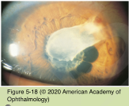
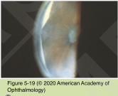
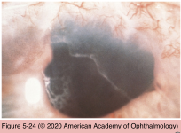
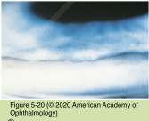
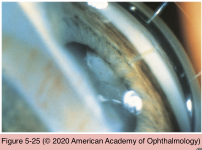
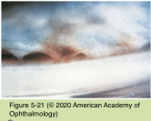
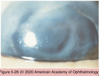
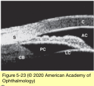
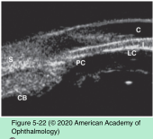

# 10.5.5. Angle-Closure Glaucoma (V): Secondary Angle Closure Without Pupillary Block (II)

## Images

## Hierarchy

- Inflammation
  - pathogenesis
    - posterior synechiae
    - secluded pupil & iris bombé
    - PAS
      - inflammation
        - organization of inflammatory debris in the angle
        - bridging of the angle by large keratic precipitates
        - preferentially in the inferior angle
          - in PACG, PAS preferentially occur in the superior angle
        - nonuniform in shape and height
    - rubeosis iridis and neovascular glaucoma
      - rare
    - anterior rotation of the ciliary body
      - uveal effusion
    - forward displacement of the lens–iris interface
      - massive exudative retinal detachment
      - choroidal effusion
  - treatment
    - aqueous suppressants
    - corticosteroids
  - interstitial keratitis
    - PAS formation
    - multiple cysts of the iris pigment epithelium
- Epithelial and Fibrous Ingrowth
  - epithelium and/or connective tissue invades the anterior chamber through a defect in a wound site
  - rare
  - risk factors
    - prolonged inflammation
    - wound dehiscence
    - delayed wound closure
    - Descemet membrane tear
  - Epithelial ingrowth
    - grayish, sheetlike growth on the trabecular meshwork, iris, ciliary body, and posterior surface of the cornea
    - often associated with
      - vitreous incarceration
      - wound gape
      - ocular inflammation
      - hypotony secondary to choroidal effusions
      - corneal edema
    - reported after Descemet-stripping automated endothelial keratoplasty
    - pathology
      - nonkeratinized stratified squamous epithelium
      - avascular subepithelial connective tissue layer
    - diagnostic tests
      - cytologic examination of an aqueous aspirate
        - argon laser produces characteristic white burns on the epithelial membrane on the iris surface
    - treatment
      - radical surgery
        - to remove the intraocular epithelial membrane and the affected tissues
        - to repair the fistula
      - prognosis remains poor
  - Fibrous ingrowth
    - fibrous ingrowth more common than epithelial downgrowth
    - from a penetrating wound
    - common cause of corneal graft failure
      - thick, gray-white, vascular retrocorneal membrane with an irregular border
    - ingrowth often involves the angle
      - PAS
      - destruction of the trabecular meshwork
      - secondary ACG
        - often difficult to control
        - surgical intervention may be required
    - progresses slowly and is often self-limited
- unlike epithelial proliferation!
- Aqueous Misdirection
  - "malignant glaucoma"
  - rare
  - pathogenesis
    - setting
      - following ocular surgery in patients with a history of angle closure or PAS
      - spontaneously in eyes with open angle following cataract surgery or various laser procedures
    - anterior rotation of the ciliary body
    - posterior misdirection of the aqueous
    - relative block to aqueous movement at the level of the lens equator, vitreous face, and ciliary processes
  - clinical presentation
    - in contrast to acute PACG, which presents with iris bombé and a shallow peripheral anterior chamber
    - uniform flattening of both the central and peripheral anterior chamber
      - markedly asymmetrical to the fellow eye
    - anterior displacement of the lens, pseudophakos, or vitreous face
    - optically clear “aqueous” zones may be seen in the vitreous
  - differential diagnosis
    - in the early postoperative setting difficult to distinguish from
      - choroidal effusion
      - suprachoroidal hemorrhage
      - intensive cycloplegic therapy
        - pupillary block
  - management
    - medical
      - triad of
        - aggressive aqueous suppression with β- adrenergic antagonists, α2-adrenergic agonists, and carbonic anhydrase inhibitors
        - miotics should not be used
          - shrinking of the vitreous with hyperosmotic agents
          - can make aqueous misdirection worse
    - laser hyaloidotomy
      - anterior vitreous can be disrupted with the Nd:YAG laser
      - aphakic and pseudophakic eyes
      - 50% of patients can be controlled with laser hyaloidotomy and medical management
    - argon laser photocoagulation of the ciliary processes
      - may alter the adjacent vitreous face
    - pars plana vitrectomy with anterior hyaloido- zonulectomy combined with an anterior chamber deepening procedure
      - definitive surgical treatment
- Tumors
  - unilateral
  - pathogenesis
    - anterior shifting of the lens–iris interface
      - posterior segment tumors
        - posterior uveal melanoma
        - posterior uveal metastases
        - retinoblastoma
    - posterior synechia and PAS formation
      - breakdown of the blood–aqueous barrier and inflammation
    - iris neovascularization
      - retinoblastoma
      - choroidal melanoma
        - medulloepithelioma
    - direct angle closure by tumor
      - anterior uveal cysts
- miotics should not be used for
  - phacomorphic glaucoma
  - microspherophakia
  - aqueous misdirection
- Nonrhegmatogenous Retinal Detachment and Uveal Effusions
  - nonrhegmatogenous retinal detachment
  - uveal effusion or hemorrhage
  - mass effect in the vitreous
    - push forward against the lens
      - forward displacement of the lens–iris interface
