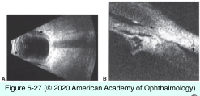

# 10.5.6. Angle-Closure Glaucoma (VI): Secondary Angle Closure Without Pupillary Block (III)

## Images

## Hierarchy

- especially encircling bands
- Retinal Surgery and Retinal Vascular Disease
  - Scleral buckling
    - produces shallowing of the anterior chamber angle and frank ACG
    - pathogenesis
      - choroidal effusion
      - anterior rotation of the ciliary body
        - flattening of the peripheral iris + relatively deep central anterior chamber
    - treatment
      - usually, the anterior chamber deepens over days to weeks
      - medical therapy
        - cycloplegics
        - anti-inflammatory agents
        - β-adrenergic antagonists
        - carbonic anhydrase inhibitors
        - hyperosmotic agents
      - if medical management is unsuccessful
        - argon laser iridoplasty
        - drainage of suprachoroidal fluid
        - adjustment of the scleral buckle
        - if scleral buckle compresses a vortex vein
          - remove scleral buckle or release tension on the band
        - iridectomy
          - usually of little benefit
  - Pars plana vitrectomy
    - injection of air, long-acting gases, or silicone oil
      - rise to the top of the eye
    - treatment options
      - iridectomy may be beneficial
        - should be located inferiorly
      - removal of the silicone oil/expansile gases
      - release of the encircling element
      - primary glaucoma surgery
        - trabeculectomy
        - implantation of glaucoma drainage devices
        - cilioablation
  - Panretinal photocoagulation
    - thickened and anteriorly rotated ciliary body
    - anterior annular choroidal detachment
    - treatment
      - secondary glaucoma is self-limited
      - temporary medical management
        - cycloplegic agents
        - topical corticosteroids
        - aqueous suppressants
  - Central retinal vein occlusion (CRVO)
    - swelling of the choroid and ciliary body
      - early shallowing of the chamber angle
    - treatment
      - medical therapy for the elevated IOP
        - chamber deepens and the glaucoma resolves over 1 to several weeks
      - topical corticosteroids
      - cycloplegia
      - if the contralateral eye has occludable angle, consider an underlying pupillary block
        - possible need for bilateral iridectomy
- Drug-Induced Secondary Angle-Closure Glaucoma
  - Topiramate
    - sulfamate-substituted monosaccharide
    - oral
    - indications
      - epilepsy
      - depression
      - headaches
      - pseudotumor cerebri
    - pathogenesis
      - ciliochoroidal effusion
        - profound anterior displacement of the lens–iris complex
      - pupillary block is not an underlying mechanism of this syndrome
    - clinical presentation
      - bilateral
      - usually within 1 month of initiating topiramate
      - acute myopic shift
      - acute ACG
        - sudden loss of vision
        - ocular pain
          - similar to malignant glaucoma
        - headache
        - anterior iris and lens displacement
          - closed anterior chamber angle
            - uniformly shallow anterior chamber
        - microcystic corneal edema
        - elevated IOP (40–70 mm Hg)
      - ciliochoroidal effusion/detachment
    - treatment
      - immediate discontinuation of the topiramate
        - myopia resolves within 1–2 weeks of discontinuing the topiramate
      - medical treatment for the elevated IOP
        - aqueous suppressants
        - acetazolamide
          - orally or intravenously
        - aggressive cycloplegia
        - glaucoma usually resolves ≤24–48 hours with medical treatment
      - peripheral iridectomy is not indicated
  - Other sulfonamides, such as acetazolamide
    - cause a similar clinical syndrome
  - references
- Flat Anterior Chamber
  - can result in the formation of PAS
  - hypotony
    - indicates a wound leak
      - Seidel test
  - treatment
    - pressure patching
    - bandage contact lens
    - surgical repair + AC reformation
      - some ophthalmologists repair wound leak and re-form flat chamber within 24 hours
        - early intervention
          - hyaloid face is in contact with the cornea
          - IOL is in contact with the cornea
          - corneal edema
          - excessive inflammation
          - posterior synechiae formation
      - others prefer observation in conjunction with corticosteroid therapy for several days
        - iridocorneal contact is well tolerated!
- Nanophthalmos
  - unusually small eye with normal shape
    - shortened axial length (<20 mm)
    - small corneal diameter
    - markedly hyperopic
    - relatively large lens for the volume of the eye
    - thickened sclera
      - may impede drainage from the vortex veins
        - choroidal effusion
          - after intraocular surgery
          - can induce ACG
            - may occur spontaneously
    - highly susceptible to ACG
      - occurs at an earlier age than in primary angle closure
  - treatment
    - laser iridotomy
    - argon laser peripheral iridoplasty
    - medical therapy
    - surgery should be avoided if possible
    - prophylactic posterior sclerotomies
      - may reduce the severity of intraoperative choroidal effusion when intraocular surgery is employed
    - lensectomy
      - for angles that remain compromised despite a patent iridotomy
      - limited core vitrectomy is sometimes needed to provide adequate ACD to accomplish safe lens removal
- Persistent Fetal Vasculature
  - unilateral
  - microphthalmos and elongated ciliary processes
  - pathogenesis
    - contraction of retrolental membrane
      - progressive shallowing of the anterior chamber angle
    - swelling of cataractous lens
  - ACG occurs at 3–6 months of age
    - may occur later in childhood
