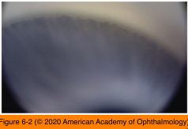
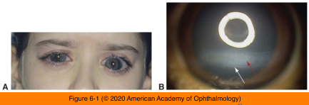

# 10.6.1. Childhood Glaucoma (I)

## Images

## Hierarchy

- Classification
  - Primary
    - developmental glaucomas with congenital anomalies of the filtration angle
      - See Table 6-1
    - classic features
      - enlarged and/or cloudy corneas
      - Haab striae
      - elevated IOP
    - types
      - congenital glaucoma (congenital open-angle glaucoma)
        - newborn PCG
          - at birth or <1 month of age
          - 25%
        - infantile PCG
          - <2 years of life
        - late-diagnosed PCG
          - .>2 years of age
        - 75% diagnosed within the first year of life
      - juvenile open-angle glaucoma
        - later in childhood or in early adulthood
          - 4-35 years
      - glaucoma associated with systemic diseases
        - chromosomal disorders
        - connective tissue disorders (ie, Marfan and Stickler syndromes)
        - phakomatoses
      - glaucoma associated with other ocular anomalies
        - aniridia
        - Peters anomaly
        - Axenfeld-Rieger syndrome
  - Secondary
    - trauma
    - intraocular neoplasms
    - inflammation
    - lens-induced disorders
    - surgical interventions
    - angle closure
    - infection
    - neovascularization
    - corticosteroid use
    - elevated episcleral venous pressure
    - See Table 6-2
- Primary Congenital Glaucoma (PCG)
  - epidemiology
    - PCG accounts for majority of primary pediatric glaucomas
    - 70% bilateral
    - 75% diagnosed within the first year of life
    - ethnicity
      - 65% M
      - Slovakian Roms
        - 1 in 1250
      - Great Britain
        - 1 in 18,500
    - consanguinity greatly increases the risk
    - without a family history of PCG, an affected parent has a 2% chance of having a child with PCG
    - newborn PCG
      - 25%
  - pathogenesis
    - increased outflow resistance through the trabecular meshwork
    - developmental anomaly of the neural crest– derived tissue of the anterior chamber angle
      - dysgenesis and compression of the trabecular meshwork
      - anterior insertion of the iris root
  - clinical presentation
    - classic triad
      - epiphora
      - photophobia
      - blepharospasm
    - increased corneal diameter and enlargement of the globe (buphthalmos)
      - until age 3, elevated IOP causes the cornea to stretch
    - Haab striae
      - breaks in Descemet membrane
      - corneal edema
      - corneal opacification
    - .>age 3 years
      - cornea does not continue to enlarge
      - scleral stretching causes progressive myopia
  - worse prognosis
    - newborn PCG
      - 1/2 patients with newborn PCG progress to legal blindness
    - glaucoma diagnosed >1 year of age
    - corneal diameter >14 mm
    - prognosis best for patients whose glaucoma is diagnosed between 3 and 12 months
      - vast majority respond to angle surgery
  - differential diagnosis
    - PCG should be considered in the differential diagnosis of any child who presents with tearing
      - See Table 6-3
      - milder cases have fewer signs and symptoms and may be misdiagnosed as nasolacrimal duct obstruction
  - treatment
    - surgical intervention
    - medical therapy
      - limited long-term value
      - may be used to temporize or reduce corneal edema to improve visualization during surgery
- CYP1B1 gene
  - drug-metabolizing enzyme cytochrome P450, family 1, subfamily B, polypeptide 1
- LTBP2 gene
  - latent transforming growth factor beta-binding protein 2
- autosomal dominant
  - GLC1A locus
- Genetics
  - genetic testing should be considered for
    - parents of pediatric glaucoma patients
    - adults whose glaucoma had its onset in childhood or early adulthood
  - PCG
    - sporadic
      - most cases
    - familial
      - 10%–40%
      - autosomal recessive
        - incomplete or variable penetrance
        - 3 genetic loci
          - GLC3A
          - GLC3B
          - GLC3C
            - TIGR/MYOC gene
              - trabecular meshwork inducible glucocorticoid response/myocillin
  - juvenile open-angle glaucoma
    - sporadic
      - occasional
  - other ocular anomalies
    - Axenfeld-Rieger syndrome
      - autosomal dominant
        - in contrast to PCG
        - variable interaction between these 2 genes may underlie the diverse phenotypic expression
    - Peters anomaly
      - PITX2
        - AD
      - FOXC1
      - PAX6
        - PAX6 gene
      - most cases are sporadic
        - CYP1B1
    - aniridia
      - autosomal dominant
        - 2/3
      - sporadic
        - 1/3
- PITX2
  - at 4q25
- FOXC1
  - at 6p25
- TIGR/MYOC gene
  - trabecular meshwork inducible glucocorticoid response/myocillin
- Juvenile Open-Angle Glaucoma
  - 4-35 years
  - autosomal dominant
    - most cases
    - GLC1A locus
  - it does not usually cause corneal enlargement or Haab striae
  - progressive myopia
    - may continue to develop
  - angles appear normal
  - treatment
    - medical therapy
      - usually unsuccessful
    - angle procedures
      - may be helpful in select cases
    - trabeculectomy or implantation of a glaucoma drainage device
