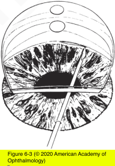
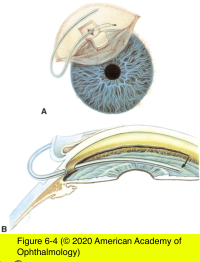

# 10.6.4. Childhood Glaucoma (IV): Surgical Management

## Images

## Hierarchy

- glaucoma surgery in children poses unique difficulties
  - surgery is the preferred definitive therapy for PCG
  - anatomical landmarks are distorted in buphthalmic eye
  - thin sclera
- decision to proceed with angle surgery is often made during an EUA
  - if glaucoma is diagnosed, angle surgery should be performed during the same anesthesia session
  - if angle surgery is anticipated, it is best not to dilate the eye during the EUA to protect the lens
- trabeculectomy
  - low success rate <2 years and in aphakic eyes
    - bleb scarring/failure common without antifibrotics
    - serious risks of bleb leak/infection with antifibrotics
      - mitomycin C should be used with caution in the pediatric patient
        - until the child is old enough to understand good hygiene
  - trabeculectomy & glaucoma drainage device should be considered when
    - 2 or more angle surgeries are not successful
      - adjunctive medical therapy is inadequate
    - forms of glaucoma other than PCG
      - angle surgery is often successful in aphakic glaucoma and in new onset of glaucoma in aniridia
- glaucoma drainage device
  - avoid the risk of bleb-related infections
  - complications
    - anterior migration of the drainage device with resultant corneal damage
    - tube blockage
    - cataract
    - motility disturbances
    - bleb encapsulation with elevated IOP
    - pupil distortion
  - IOPs are usually higher than after trabeculectomy
    - most children will need to continue topical glaucoma medications
- angle surgery
  - goniotomy
    - clear cornea
    - angle is visualized with a surgical gonioscopic contact lens
    - needle knife
    - superficial incision is made in the uveal trabecular meshwork
    - advantages
      - no postoperative conjunctival scarring
      - faster
      - less trauma to the anterior segment tissues
  - trabeculotomy ab externo
    - clear or cloudy cornea
    - conjunctival flap
    - partial-thickness scleral flap
      - OR
        - radial incision into the sclera
    - Schlemm canal is cannulated from an ab externo approach
      - fine wirelike instrument (trabeculotome)
      - 6-0 nonabsorbable polypropylene suture (Prolene)
        - for 360°
    - trabecular meshwork is opened by breaking through the Schlemn canal into the anterior chamber
    - avoid creating a false passage or entering the subretinal or suprachoroidal spaces
    - fill the anterior chamber with viscoelastic at the start of goniotomy and trabeculotomy
      - thorough removal of the viscoelastic at the end of the procedure is necessary
    - advantages
      - more familiar to surgeons experienced in adult glaucoma procedures
      - can be performed in an opacified cornea
      - can be converted to a trabeculectomy if the Schlemm canal cannot be cannulated
  - complications
    - hyphema
    - infection
    - lens damage
    - uveitis
    - Descemet membrane may be stripped during trabeculotomy
    - general anesthesia may cause serious complications in children
      - bilateral procedures are performed in some children
  - may also be used to treat other forms of childhood glaucoma
    - aniridia
    - Axenfeld-Rieger syndrome
    - Sturge-Weber syndrome
  - successful in 70%–80% of infants with PCG who present between 3 months and 1 year of age
    - a second procedure may be required
- cyclophotocoagulation
  - cases refractory to other surgical and medical treatments
    - useful for providing additional IOP lowering after glaucoma drainage device surgery
  - general anesthesia
  - techniques
    - cyclocryotherapy
    - transscleral cyclophotocoagulation (CPC) with (Nd:YAG) or diode laser
    - endoscopic cyclophotocoagulation (ECP)
      - particularly useful in eyes with
        - distorted anterior segment anatomy
        - prior unsuccessful CPC or cryotherapy
  - disadvantages
    - difficult to titrate the results
    - serious potential complications
      - hypotony
        - phthisis
      - uveitis
      - blindness
      - rate of complications is lower with laser procedures than with cryotherapy
