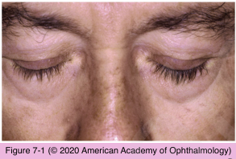

# 10.7.1. Medical Management of Glaucoma (I)

## Images

## Hierarchy

- General
  - criteria for treatment
    - 3 principal criteria
      - life expectancy of the patient
      - stage of disease
      - degree of IOP elevation
        - rate of disease progression
    - other criteria
      - presence or absence of optic disc hemorrhages
      - family history
  - goal of treatment
    - preserving visual function by lowering IOP
      - lowest risk
      - fewest adverse effects
      - least amount of disruption to patient’s life
      - cost of treatment
  - target pressure
    - low target pressure
      - more advanced optic neuropathy
      - optic nerve damage in presence of normal IOP
    - do not set a rigid target pressure
      - should be individualized
      - target pressure level should be a broad range
      - may require revision
    - initial IOP reduction of ≥20% from baseline is a suggested minimum
  - treatment of ACG with pupillary block and of primary congenital glaucoma is primarily surgical
  - initial treatment of POAG has commonly been medical
  - treatment of secondary glaucoma is similar to that of primary glaucoma
  - Glaucoma Laser Trial (GLT)
    - as initial therapy, argon laser trabeculoplasty was at least as effective as medications
  - Collaborative Initial Glaucoma Treatment Study (CIGTS)
    - medical therapy was essentially equally as effective as surgical therapy in preventing POAG progression
  - therapeutic trial
    - starting medication in 1 eye to assess efficacy
  - reverse therapeutic trial
    - stopping a medication in 1 eye
  - references
- permanent
- Prostaglandin Analogues
  - 4 prostaglandin analogues
    - latanoprost
    - travoprost
      - prodrugs that penetrate the cornea
        - hydrolyzed by corneal esterase
          - biologically active
    - bimatoprost
  - mechanism
    - not known
      - tafluprost
    - latanoprost
      - increased spaces between ciliary body muscle fascicles
        - increasing uveoscleral outflow
  - IOP lowering effect
    - latanoprost
      - 25%–32%
    - travoprost
      - 25%–32%
    - bimatoprost
      - 27%–33%
    - tafluprost
      - similar to latanoprost
  - some patients may respond better to one agent than to another
    - switching drugs after a trial of 4–6 weeks
  - bimatoprost, latanoprost, and travoprost reach peak effect 10–14 hours after administration
    - bedtime application is recommended
      - peak IOP is in the morning
        - aqueous formation decreases during sleep
  - ocular side effect
    - iris hyperpigmentation
      - increased number of melanosomes within the melanocytes
      - ≤33% after 5 years
        - ≤79% with green-brown irides
        - ≤85% with hazel (yellow-brown) irides
        - 8% with blue irides
    - conjunctival hyperemia
      - more common with bimatoprost and travoprost
      - reversible with drug discontinuation
        - reversible with drug discontinuation
    - hypertrichosis
      - reversible with drug discontinuation
    - trichiasis
    - distichiasis
      - reversible with drug discontinuation
    - hyperpigmentation of eyelid skin
      - reversible with drug discontinuation
    - hair growth around the eyes
      - reversible with drug discontinuation
    - exacerbation of herpes keratitis
    - exacerbation of cystoid macular edema
      - especially in aphakic or uveitic eyes
    - uveitis
      - 1%
  - references
- Medical Agents
  - prostaglandin analogues
  - β-adrenergic antagonists (nonselective and selective)
  - adrenergic agonists
  - carbonic anhydrase inhibitors (oral and topical)
  - parasympathomimetic (miotic) agents, including cholinergic and anticholinesterase agents
  - hyperosmotic agents
  - combination medications
  - See Table 7-1
