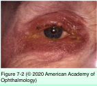

# 10.7.3. Medical Management of Glaucoma (III)

## Images

## Hierarchy

- Parasympathomimetic Agents (Miotics)
  - mechanism of action
    - postganglionic parasympathetic junctions
      - direct-acting agents
        - affect the motor end plates similar to acetylcholine
      - indirect-acting agents
        - inhibit acetylcholinesterase
          - enhance naturally secreted acetylcholine
      - contraction of longitudinal ciliary muscle
        - pulls the scleral spur to tighten the trabecular meshwork
          - increases outflow of aqueous humor
  - indirect-acting
    - echothiophate iodide
    - out of use
  - direct-acting
    - pilocarpine
      - 15%–25% reduction in IOP
  - ocular side effects
    - Induced myopia
      - ciliary muscle contraction
    - brow ache
      - ciliary spasm
    - miosis
      - interferes with vision in dim light with lens opacities
    - retinal detachment
      - peripheral retinal evaluation before the initiation of therapy
    - cataract
      - particularly indirect-acting agents
    - iris pigment epithelial cysts
      - in children
    - epiphora
      - direct lacrimal stimulation
      - punctal stenosis
    - drug-induced pseudopemphigoid
    - increased bleeding during surgery
    - blood–aqueous barrier break-down
      - avoid if possible in patients with uveitic glaucoma
      - increased inflammation & severe fibrinous iridocyclitis postoperatively
    - paradoxical angle closure
      - eyes with phacomorphic narrow angles
        - contraction of ciliary muscle leads to forward movement of the lens–iris interface & increase in the anteroposterior diameter of the lens
  - systemic adverse effects
    - mainly with indirect-acting medications
      - diarrhea
      - abdominal cramps
      - increased salivation
      - bronchospasm
      - enuresis
      - depolarizing muscle relaxants (succinylcholine)
        - cannot be used for ≤6 weeks after stopping indirect-acting agents
  - indications for miotic therapy
    - prophylaxis for angle-closure glaucoma prior to iridectomy
    - long-term treatment of elevated IOP in patients whose drainage angles are persistently occludable despite laser iridotomy
    - now rarely used in the treatment of POAG
      - poorly tolerated
        - much better tolerated in aphakic than in phakic eyes
      - poor compliance
        - 2–4x/day regimen
    - among the most affordable of agents
  - pilocarpine gel
    - once daily at bedtime
    - nocturnal dosing reduces problems from induced myopia and miosis
    - relatively poorly tolerated, especially in younger patients
- Adrenergic Agonists
  - nonselective adrenergic agonists
    - drugs
      - epinephrine (adrenaline)
      - dipivefrin (a prodrug of epinephrine)
    - increase conventional trabecular and uveoscleral outflow
    - no longer used in the management of POAG
    - not used concomitantly with β-blockers because of lack of additional efficacy
  - α1-adrenergic agonists
    - phenylephrine
    - ocular effects
      - vasoconstriction
      - pupillary dilation
      - eyelid retraction
  - α2-adrenergic agonists
    - ocular effects
      - IOP reduction
        - less selective α2-adrenergic action than brimonidine
      - possibly neuroprotection
    - drugs
      - apraclonidine
        - greater affinity for α1-receptors than brimonidine
          - more vasoconstriction
        - true ocular hypotensive mechanism is not fully understood
          - decreases aqueous production
          - improves trabecular outflow
          - argon laser iridotomy
            - decreases episcleral venous pressure
        - effective in diminishing the acute rise in IOP that follows
          - argon laser trabeculoplasty
          - Nd:YAG laser capsulotomy
          - cataract extraction
        - effective for short-term lowering of IOP
          - limited long-term use
            - topical sensitivity
            - tachyphylaxis
      - brimonidine
        - more selective α2-adrenergic action
        - IOP lowering mechanism
          - decreasing aqueous production
          - increasing uveoscleral outflow
          - peripheral mechanism
            - 1-week, single-eye treatment caused reduction of 1.2 mm Hg in the fellow eye
        - peak IOP reduction ≈ 26% (2 hours postdose)
          - comparable to a nonselective β-blocker
          - superior to selective β-blocker betaxolol
          - at trough (12 hours postdose), reduction is only 14%–15%
            - less than the reduction achieved with nonselective β-blockers
        - ocular allergic reaction
          - follicular conjunctivitis
          - contact blepharodermatitis
          - less than apraclonidine
            - <40% for apraclonidine
            - <15% for brimonidine tartrate 0.2% preserved with benzalkonium chloride
            - <10% for brimonidine tartrate 0.1% preserved with Purite
              - as efficacious as brimonidine 0.2% preserved with benzalkonium chloride
              - lower incidence of all side effects
          - cross-sensitivity to brimonidine in patients with known hypersensitivity to apraclonidine is minimal
        - long-term intolerance due to local adverse effects is high (>20%)
          - local blepharoconjunctivitis
          - ectropion
          - granulomatous anterior uveitis
        - systemic adverse effects
          - dry mouth
          - lethargy
            - contraindicated <3 years
              - crosses the BBB
            - use with caution 3-10 years
          - should not be used in infants and young children
            - respiratory arrest
            - somnolence
            - hypotension
            - seizures
            - derangements of neurotransmitters in the CNS
          - caution recommended when apraclonidine or brimonidine is used in patients on a monoamine oxidase inhibitor (MAOI) or tricyclic antidepressant therapy
        - approved for 3x/day
          - less tachyphylaxis than apraclonidine
          - commonly used twice daily
