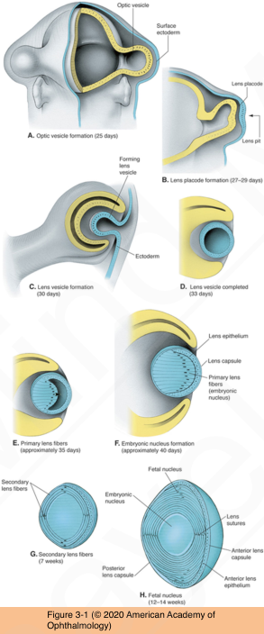
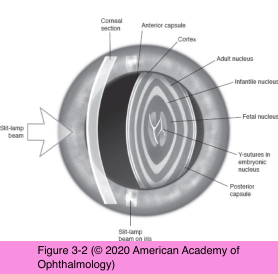
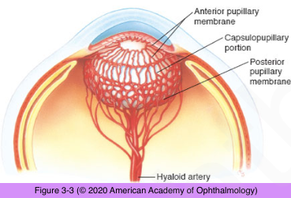

# 11.3.1. Developmental Defects (I): Normal Development

## Images

## Hierarchy

- secondary lens fibers
  - epithelial cells near the lens equator elongate to form secondary lens fibers
  - detach from the capsule and lose their nucleus and membrane-bound organelles
  - secondary lens fibers formed between 2 and 8 months of gestation
    - fetal nucleus
  - lens weighs approximately 90 mg at birth
    - weight increases about 2 mg/year
- lens sutures
  - the ends of the fibers on one side meet and interdigitate with the ends of fibers arising on the opposite side of the lens (nucleus)
  - anterior Y-suture
    - erect
  - posterior Y-suture
    - inverted
  - as the lens continues to grow, the pattern of lens sutures becomes increasingly complex
- optic vesicles
  - 25 days of gestation
  - from the forebrain
  - enlarge and extend laterally
  - become closely apposed and adherent to the surface ectoderm
- lens placode
  - 27 days of gestation
  - ectoderm cells that overlie the optic vesicles become columnar
  - bone morphogenetic protein (BMP) family of growth factors
- tunica vasculosa lentis
  - 1 month of gestation
  - hyaloid artery forms a network of capillaries on the posterior surface of the lens capsule
    - grow toward the lens equator
  - ciliary veins form anterior pupillary membrane
  - disappears by programmed cell death shortly before birth
- lens pit
  - 29 days of gestation
  - indentation (infolding) of the lens placode
  - deepens and invaginates to form the lens vesicle
- lens vesicle
  - 30-33 days of gestation
  - stalk of cells connecting the optic pit to the surface ectoderm degenerates (apoptosis)
  - sphere
    - single layer of cuboidal cells
      - apices of the cuboidal cells are oriented toward the lumen of the lens vesicle
    - encased in a basement membrane (the lens capsule)
- zonules of Zinn
  - end of the 3rd month of gestation
  - secreted by the ciliary epithelium
- primary lens fibers and the embryonic nucleus
  - 35-40 days of gestation
  - cells in the posterior layer of the lens vesicle stop dividing and begin to elongate (primary lens fibers)
    - primary lens fibers
      - fill the lumen of the lens vesicle
        - embryonic nucleus
    - nuclei and other membrane-bound organelles undergo degradation
      - reduces light scattering
  - cells of the anterior lens vesicle remain as a monolayer of cuboidal cells
    - lens epithelium
      - subsequent growth of the lens is due to proliferation within the epithelium
