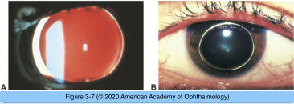
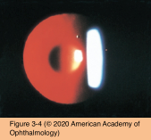

# 11.3.2. Developmental Defects (I)

## Images

## Hierarchy

- Microspherophakia
  - faulty development of secondary lens fibers
  - clinical presentation
    - small spherical lens
    - high myopia
    - secondary angle-closure glaucoma
      - miotics aggravate this condition
      - cycloplegics are the medical treatment of choice
      - laser iridotomy
  - associated syndromes
    - Weill-Marchesani syndrome
      - most common associated syndrome
      - autosomal recessive
      - small stature
      - short and stubby fingers
      - broad hands with reduced joint mobility
    - Marfan syndrome
    - Peters anomaly
    - Alport syndrome
    - Lowe syndrome
      - oculocerebrorenal syndrome of Lowe
        - x-linked
        - systemic acidosis
        - renal rickets
        - hypotonia
        - congenital cataract
          - focal, internally directed excrescences of lens capsule
        - microspherophakia
    - congenital rubella
    - isolated
- Lenticonus and Lentiglobus
  - lenticonus
    - localized, cone-shaped deformation of the lens surface
    - anterior lenticonus
      - often bilateral
      - may be associated with Alport syndrome
        - Alport syndrome
          - X-linked > AR > AD
          - disease of basement membranes
            - collagen type IV
          - extraocular presentation
            - progressive renal failure
              - late in the course of the disease
                - hypertension
                - kidney failure
            - hematuria
              - begins in childhood
            - sensori-neural deafness
          - ocular presentation
            - anterior lenticonus or anterior subcapsular cataract
            - posterior polymorphous dystrophy
            - fleck retinopathy
    - posterior lenticonus
      - more common
      - usually unilateral
  - lentiglobus
    - localized spherical deformation of the lens surface
    - posterior lentiglobus is more common than anterior lentiglobus
      - often associated with posterior pole opacities
  - retinoscopy
    - distorted and myopic reflex in both lenticonus and lentiglobus
  - retroillumination
    - “oil droplet” reflex
  - posterior bulging may progress
    - worsening myopia
    - opacification of the defect
    - +- opacification of surrounding cortical lamellae
