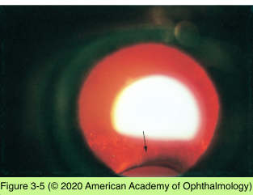
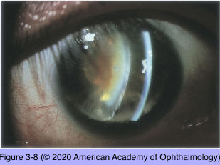
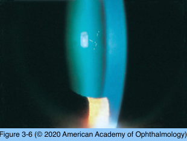

# 11.3.3. Developmental Defects (II)

## Images

## Hierarchy

- Congenital Aphakia
  - very rare
  - usually associated with other malformations
  - primary aphakia
    - lens placode fails to form
  - secondary aphakia
    - developing lens is spontaneously absorbed
    - more common type
- Peters anomaly
  - absence of separation of lens vesicle from the surface ectoderm
  - anterior segment dysgenesis syndrome
  - mutation in genes normally involved in anterior segment development
    - PAX6, PITX2, FOXC1, CYP1B1
  - central or paracentral corneal opacity (leukoma)
  - thinning or absence of adjacent endothelium and descemet membrane
  - associated lens anomalies
    - adhesions between lens and cornea
    - anterior cortical or polar cataract
    - a misshapen lens displaced anteriorly into the pupillary space and the anterior chamber
    - microspherophakia
- Lens Coloboma
  - indentation/flattening of the lens periphery
  - 2 types
    - primary coloboma
      - isolated anomaly
    - secondary coloboma
      - caused by the lack of ciliary body or zonular development
  - typically located inferiorly
  - zonular attachments in the region of the coloboma usually are weakened or absent
  - +- colobomas of the uvea
  - +- cortical lens opacification or thickening of the lens capsule adjacent to the coloboma
- Mittendorf Dot
  - in many healthy eyes
  - remnant of the posterior pupillary membrane
    - where the hyaloid artery came into contact with the posterior surface of the lens
  - small, dense white spot
    - inferonasal to the posterior pole of the lens
    - +- fibrous tail or remnant of the hyaloid artery projecting into the vitreous body
- Aniridia
  - partial or nearly complete absence of the iris
  - Associated findings
    - corneal pannus and epitheliopathy
    - glaucoma
    - foveal and optic nerve hypoplasia
    - nystagmus
    - cataract
      - anterior and posterior polar lens opacities
        - present at birth
      - cortical, subcapsular, and lamellar opacities
        - develop in 50%–85%
        - within the first 2 decades
    - ectopia lentis
      - poor zonular integrity
  - genetics
    - familial
      - 2/3
      - AD
        - PAX6
    - sporadic
      - 1/3
      - associated with a high incidence of Wilms tumor
        - WAGR complex
          - Wilms tumor, aniridia, genitourinary malformations, and mental retardation
- Epicapsular star
  - common remnant of the tunica vasculosa lentis
  - unilateral or bilateral
  - tiny brown or golden flecks
    - star-shaped
    - on the central anterior lens capsule
