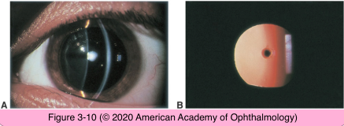
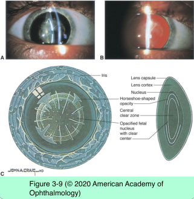
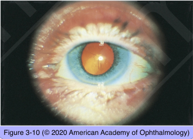

# 11.3.4. Developmental Defects (III): Congenital Cataract (I)

## Images

## Hierarchy

- Introduction
  - present at birth or within first year of life
  - 1/2000 live births
  - unilateral or bilateral
    - metabolic diseases tend to be associated with bilateral cataracts
  - etiology
    - part of a more extensive syndrome or disease
      - 1/3
    - isolated inherited trait
      - 1/3
    - undetermined causes
      - 1/3
    - bilateral
      - idiopathic
      - hereditary
        - most are AD
      - genetic/metabolic
      - maternal infection
      - ocular anomalies
      - toxic/radiation
    - unilateral
      - idiopathic
      - ocular anomalies
      - trauma
      - rubella
      - masked bilateral cataract
- Polar
  - involves the subcapsular cortex and capsule of the anterior or posterior pole of the lens
  - Anterior polar cataracts
    - autosomal dominant
    - small
    - bilateral
    - symmetric
    - nonprogressive
    - cause anisometropia
      - do not impair vision
    - associated ocular abnormalities
      - microphthalmos
      - persistent pupillary membrane
      - anterior lenticonus
    - do not require treatment
  - Posterior polar cataracts
    - stable
      - occasionally progress
    - +- capsular fragility
    - genetics
      - sporadic
        - unilateral
        - associated with
          - remnants of the tunica vasculosa lentis
          - lenticonus or lentiglobus
      - familial
        - bilateral
        - autosomal dominant
- produce more visual impairment
  - larger
  - closer to the nodal point of the eye
- Lamellar/zonular
  - an opacified layer that surrounds a clearer center and is surrounded by a layer of clear cortex
    - disc-shaped configuration from the front
    - riders
      - arcuate opacities straddle the equator of the lamellar cataract
  - bilateral and symmetric
  - etiology
    - +- autosomal dominant
    - transient toxic influence during embryonic development
- Sutural (stellate)
  - opacification of the Y-sutures of the fetal nucleus
  - autosomal dominant
  - bilateral and symmetric
  - does not impair vision
  - has branches or knobs
