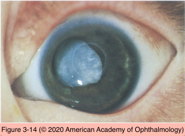
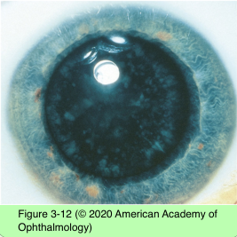
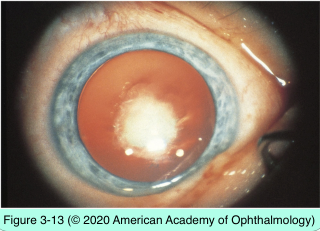

# 11.3.5. Developmental Defects (IV): Congenital Cataract (II)

## Images

## Hierarchy

- Coronary
  - club-shaped cortical opacities arranged around the equator of the lens like a crown, or corona
  - autosomal dominant
  - cannot be seen unless the pupil is dilated
  - do not affect visual acuity
- Membranous
  - lens proteins are resorbed from either an intact or a traumatized lens
    - the anterior and posterior lens capsules fuse into a dense white membrane
  - significant visual disability
- Cerulean
  - small bluish opacities located in the lens cortex
    - blue-dot cataracts
  - nonprogressive
  - do not cause visual symptoms
- Complete (total)
  - all of the lens fibers are opacified
    - may be subtotal at birth and progress rapidly
  - unilateral or bilateral
  - red reflex is completely obscured
  - profound visual impairment
- Nuclear
  - opacities of the embryonic nucleus alone or of both embryonic and fetal nuclei
  - complete nucleus or discrete layers within the nucleus
  - bilateral
  - +- microphthalmia
  - risk of developing aphakic glaucoma
- Congenital rubella syndrome
  - maternal infection with the rubella virus (RNA togavirus)
    - especially if the infection occurs during the first trimester
  - systemic manifestations
    - cardiac defects
    - deafness
    - mental disability
  - ocular manifestations
    - cataract
      - pearly white nuclear opacifications
      - +- complete cataract
        - the cortex may liquefy
      - lens-fiber nuclei are retained deep within the lens substance
      - live virus particles may be recovered from the lens as late as 3 years after birth
      - cataract removal may be complicated by excessive postoperative inflammation
        - release of live virus particles!
    - diffuse pigmentary retinopathy
    - microphthalmos
    - glaucoma
      - cataract and glaucoma are not present simultaneously!
    - transient or permanent corneal clouding
- Capsular
  - small opacifications of the lens epithelium and anterior lens capsule
    - spare the cortex
    - differentiated from anterior polar cataracts by their protrusion into the anterior chamber
  - generally do not adversely affect vision
