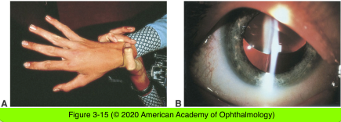

# 11.3.6. Developmental Defects (V): Ectopia Lentis (I)

## Images

## Hierarchy

- Ectopia Lentis
  - displacement of the lens
  - types
    - subluxated lens
      - partially displaced but remains in the pupillary area
    - luxated/dislocated lens
      - completely displaced from the pupil
  - clinical findings
    - decreased vision
    - marked astigmatism
    - monocular diplopia
    - iridodonesis
    - pupillary abnormalities
      - ectopia lentis et pupillae
  - potential complications
    - cataract
    - displacement of the lens into the anterior chamber
      - pupillary block and angle-closure glaucoma
    - displacement of the lens into the vitreous
      - profound change in refractive error
        - similar to congenital cataracts
  - etiology
    - congenital/developmental
      - isolated anomaly (simple ectopia lentis)
        - autosomal dominant
      - associated with other diseases
        - Marfan syndrome
        - homocystinuria
        - aniridia
        - congenital glaucoma
        - Ehlers-Danlos syndrome
        - hyperlysinemia
          - less frequent
            - deficiency of molybdenum cofactor
        - sulfite oxidase deficiency
    - acquired
      - Marfan is AD
        - trauma is the most common cause of acquired lens displacement
- Marfan syndrome
  - autosomal dominant
    - no family history in 15%
      - fibrillin gene on chromosome 15
  - systemic abnormalities
    - skeletal
      - tall
      - arachnodactyly
      - chest wall deformities
    - cardiac
      - dilated aortic root
      - mitral valve prolapse
  - ocular
    - ectopia lentis
      - 50% to 80%
      - bilateral and symmetric
        - usually superior and temporal
      - zonular attachments commonly remain intact but become stretched and elongated
      - congenital in most cases
        - in many patients the lens position remains stable
        - progression is observed in some patients
    - other ocular abnormalities
      - axial myopia
      - increased risk of retinal detachment
      - dislocation into the pupil or anterior chamber
        - pupillary block glaucoma
      - open-angle glaucoma
      - amblyopia
    - management
      - spectacle/contact lens correction
      - pupillary dilation is sometimes helpful
      - refract both the phakic and the aphakic portions of the pupil to determine the optimum visual acuity
      - reading add
        - subluxated lens lacks sufficient accommodation!
      - removal of the lens
        - if adequate visual acuity cannot be obtained with spectacle/contact lens
        - extracapsular or intracapsular
          - high rate of complications
            - vitreous loss
            - complex retinal detachment
        - lensectomy using vitrectomy instrumentation
- Homocystinuria
  - autosomal recessive
  - inborn error of methionine metabolism
    - deficiency of cystathionine β-synthase
      - increased serum levels of
        - homocysteine
        - methionine
      - cysteine deficiency
  - clinical presentation
    - healthy at birth
    - tall
    - seizures
    - mental disability
      - unlike Marfan
    - osteoporosis
    - light-colored hair
    - thromboembolic episodes
      - surgery and general anesthesia increase the risk of thromboembolism
    - Lens dislocation
      - pathogenesis
        - cysteine deficiency
          - zonular fibers have a high concentration of cysteine
      - bilateral and symmetric
      - brittle zonules
      - incidence
        - infancy
          - 30%
        - 15 years
          - 80%
      - subluxated inferiorly and nasally
  - management
    - low-methionine, high-cysteine diet
    - pyridoxine (vitamin B6) supplementation
