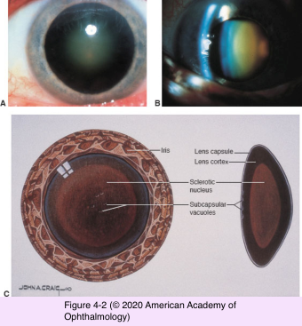
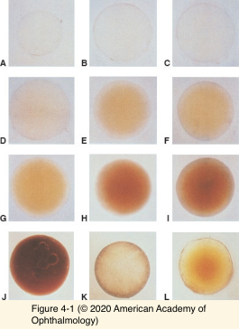

# 11.4.1. Pathology (I): Age- related Lens Changes (I)

## Images

## Hierarchy

- Introduction
  - increase in mass and thickness
  - compression and hardening (nuclear sclerosis)
  - decrease in accommodative power
  - chemical modification/proteolytic cleavage of crystallins
    - formation of high-molecular-mass protein aggregates
      - abrupt fluctuations in the local refractive index of the lens
      - light scattering
      - reduced transparency
  - increased pigmentation of nucleus
    - yellow or brown
  - decreased concentrations of
    - glutathione
    - potassium
      - reducing agent
  - increased concentrations of
    - sodium
    - calcium
- Nuclear Cataract
  - some degree of nuclear sclerosis/yellowing is normal after age 50
    - interferes only minimally with visual function
  - excessive yellowing & light scattering
    - central opacity
      - nuclear cataract
  - usually bilateral
    - may be asymmetric
  - progress slowly
  - distance vision impairment> near vision impairment
  - increase in the refractive index of the lens
    - myopic shift
      - lenticular myopia
      - second sight
        - presbyopic individuals can read without spectacles
  - monocular diplopia
  - poor color discrimination
    - at the blue end of the visible light spectrum
  - reduced photopic retinal function
  - brunescent nuclear cataract
    - advanced cases
  - histology
    - normal
  - electron microscopy
    - increased number of lamellar membrane whorls
- agents decreasing IOP
  - heroin
  - alcohol
  - cannabis
- Posterior Subcapsular Cataracts
  - etiology
    - aging
      - younger patients than those with nuclear or cortical cataracts
    - trauma
    - systemic, topical, or intraocular corticosteroid use
    - inflammation
    - ionizing radiation
    - alcoholism
  - subtle iridescent sheen
    - granular opacities
      - plaquelike opacity
        - alcohol decreases IOP
  - posterior subcapsular cortex
  - usually axial
  - symptoms
    - glare
    - poor vision
      - especially under bright lighting conditions
    - near vision impairment> distance vision impairment
    - monocular diplopia
  - posterior migration of the lens epithelial cells from the lens equator
    - the cells undergo aberrant enlargement
      - Wedl or bladder cells
- agents increasing IOP
  - LSD
  - ketamine
