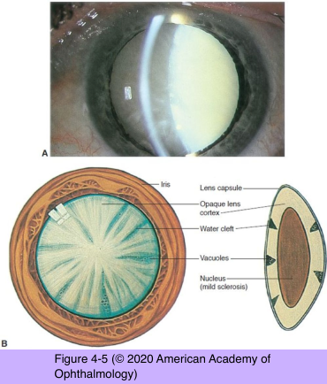
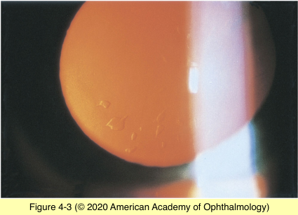
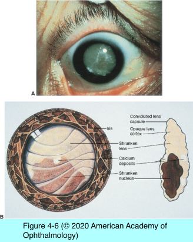
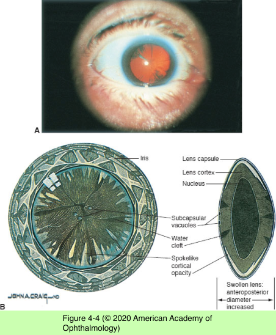
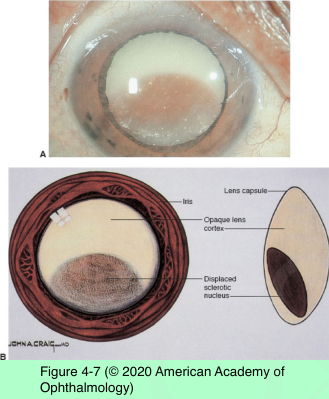

# 11.4.2. Pathology (II): Age- related Lens Changes (II): Cortical Cataract

## Images

## Hierarchy

- pathogenesis
  - disruption of lens fiber membranes
    - loss of essential metabolites
    - protein oxidation and precipitation
  - bilateral but often asymmetric
- symptoms
  - variable effect on visual function
  - glare
    - from intense focal light sources
  - monocular diplopia
- mature
  - the entire cortex becomes white and opaque
- first signs of cortical cataract formation
  - vacuoles
  - water clefts
- intumescent
  - mature cortical cataract that has become swollen
- hypermature
  - wrinkled and shrunken capsule
- wedge-shaped opacities
  - cortical spokes or cuneiform opacities
  - the pointed end of the opacities oriented toward the center
  - slit-lamp biomicroscope: white opacities
  - retroillumination: dark shadows
  - initially affect only the equatorial regions of fiber cells
    - extend toward visual axis
  - vary greatly in their rate of progression
- morgagnian cataract
  - free movement of the nucleus within the capsular bag
