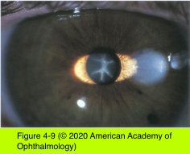

# 11.4.3. Pathology (III): Drug-Induced Lens Changes

## Images

## Hierarchy

- Amiodarone
  - antiarrhythmia medication
  - stellate pigment deposition in anterior cortical axis
    - very rarely visually significant
      - phenothiazines cause pigmented deposits in the anterior lens epithelium
  - pigment deposition in corneal epithelium
  - optic neuropathy
    - rare
- Corticosteroids
  - long-term use of corticosteroids may cause PSC
  - related to
    - dose
    - duration of treatment
  - several routes
    - topical
    - subconjunctival
    - intraocular
      - slow-release steroid repositories have not altered the IOP-elevating and PSC-producing effects of these medications
    - inhaled
    - systemic
  - patients susceptible to steroid-induced glaucoma are frequently those who develop PSC after intravitreal triamcinolone acetonide
  - histologically/clinically cannot be distinguished from senescent PSC
  - some steroid-induced PSCs in children may resolve with cessation of the drug
- Tamoxifen
  - the association previously suggested between cataract development and tamoxifen use has not been substantiated
- Phenothiazines
  - pigmented deposits in the anterior lens epithelium
    - axial configuration
  - dependent on
    - dose
    - treatment duration
  - more likely to be seen with
    - chlorpromazine
      - confused with choroideremia or Bietti crystalline corneoretinal dystrophy
    - thioridazine
      - thioridazine (high-dose)
        - severe retinopathy
          - can develop within a few weeks-months
          - rare at doses <800 mg/day
          - coarse retinal pigment stippling in the posterior pole
            - blurred vision
          - widespread nummular patchy atrophy of pigment epithelium & choriocapillaris
            - visual field loss
            - night blindness
        - visual function can improve after drug stopped
          - sometimes deteriorates later if progressive chorioretinal atrophy
        - monitoring
          - no monitoring at standard doses
            - toxicity is rare
          - suspected cases
          - patients who have taken high doses
            - monitoring similar to chloroquine
  - generally visually insignificant
- Statins
  - in studies on dogs, statins are associated with cataract when given in excessive doses
  - long-term use of statins in humans is not associated with an increased cataract risk
  - a longitudinal study reported a 50% reduction in the 5-year incidence of nuclear cataracts in patients treated with statins
  - concomitant use of simvastatin and erythromycin (which increases circulating statin levels) may be associated with 2x increased risk of cataract
- Miotics (anticholinesterases)
  - cataract formation
    - after 55 months of pilocarpine use
      - 20%
    - after echothiophate iodide use
      - 60%
  - first appears as small vacuoles within and posterior to the anterior lens capsule
    - appreciated on retroillumination
    - may progress to posterior cortical and nuclear changes
  - dependent on
    - dose frequency
    - treatment duration
    - age
      - visually significant cataracts are common in elderly patients
      - progressive cataract formation has not been reported in children
