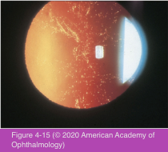
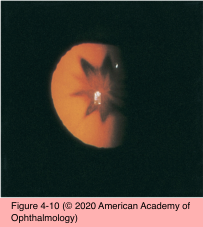
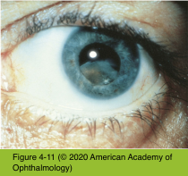
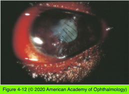
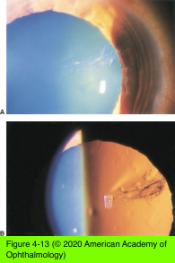

# 11.4.4. Pathology (IV): Trauma

## Images

## Hierarchy

- Chemical Injuries
  - alkali penetrate the eye readily
    - increase in aqueous pH
    - decrease in aqueous glucose and ascorbate
    - often result in cataract
      - acutely or as a delayed effect
  - acids penetrate the eye less easily than alkali
    - less likely to result in cataract
- Electrical Injury
  - protein coagulation
    - cataract formation
  - more likely when current involves the patient’s head
  - lens vacuoles
    - followed by
    - linear opacities in the anterior subcapsular cortex
  - may regress, remain stationary, or mature to complete cataract
- Contusion
  - Vossius ring
    - ring of pigment from the pupillary ruff on the anterior lens surface
    - visually insignificant
    - gradually resolves
    - indicator of prior blunt trauma
  - Traumatic cataract
    - acute or late
    - portion of lens or entire lens
    - initial manifestation
      - stellate or rosette-shaped opacification (rosette cataract)
        - axial
        - posterior lens capsule
    - +- lens dislocation
    - mild contusion cataracts can improve spontaneously in rare cases
  - Dislocation and subluxation
    - rapid equatorial expansion
      - zonular fiber disruption
    - symptoms
      - fluctuation of vision
      - impaired accommodation
      - monocular diplopia
      - high astigmatism
    - clinical presentation
      - dislocates in any direction
        - anteriorly into the anterior chamber
        - posteriorly into the vitreous cavity
      - iridodonesis
      - phacodonesis
      - retroillumination
        - zonular disruption
      - +- cataract formation
- Metallosis
  - Siderosis bulbi
    - iron intraocular foreign bodies
      - deposition of iron molecules in
        - trabecular meshwork
        - lens epithelium
          - lens involvement occurs more rapidly if the foreign body is embedded close to the lens
          - lens discoloration
            - at first, yellowish tinge
            - later, rusty brown discoloration
          - complete cortical cataract
        - iris
        - retina
          - retinal dysfunction
            - iron deposits in lens epithelium
  - Chalcosis
    - copper intraocular foreign bodies
      - copper deposition in
        - Descemet membrane
        - anterior lens capsule
        - other intraocular basement membranes
    - “sunflower” cataract
      - petal-shaped yellow or brown pigment in lens capsule
        - radiates from anterior axial pole to equator
      - usually causes no significant loss of vision
    - pure copper (>90%) can cause severe inflammatory reaction and intraocular necrosis
- Radiation
  - Ionizing radiation
    - lens is extremely sensitive to ionizing radiation
      - ≥2 Gy x-ray in one fraction
    - period of latency
      - ≤20 years between exposure and clinically apparent cataract
      - related to
        - dose of radiation
        - patient’s age
          - younger patients are more susceptible
    - first clinical signs
      - punctate opacities within the posterior capsule
      - feathery anterior subcapsular opacities
        - radiate toward the equator
      - may progress to complete lens opacification
  - Infrared radiation (glassblowers’ cataract)
    - infrared radiation + intense heat
    - outer layers of the anterior lens capsule peel off
      - true exfoliation of the lens capsule
      - exfoliated outer lamella tends to scroll up on itself
    - +- cortical cataract
  - Ultraviolet radiation
    - lens is susceptible to damage from ultraviolet (UV) radiation
    - long-term exposure to sunlight --> increased risk of cortical cataracts
      - only 10% of risk of cortical cataract in temperate climates is sunlight-related
        - avoidable risk!
    - clinicians should encourage their patients to avoid excessive sunlight exposure
      - prescription corrective lenses & nonprescription sunglasses
        - decrease UV transmission by >80%
      - wearing a hat with a brim
        - decreases ocular sun exposure by 30%–50%
    - lenses sold in the United States must conform to the American National Standards Institute (ANSI) requirements aimed at reducing UV transmission
  - Microwave radiation
    - causes cataract in lab animals
    - human case reports/epidemiologic studies are more controversial
    - anterior/posterior subcapsular opacities
- Perforating and Penetrating Injury
  - opacification of cortex at site of rupture
    - progressing rapidly to complete opacification
  - a small perforating injury of lens capsule may heal
    - stationary focal cortical cataract
- Intralenticular Foreign Bodies
  - may cause cataract formation
  - may be retained within the lens without significant complication if
    - foreign body is not ferric or cupric
    - anterior lens capsule seals
