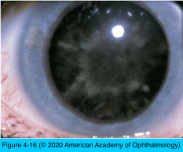
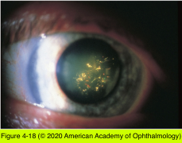
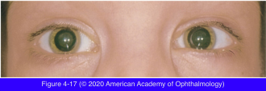

# 11.4.5. Pathology (V): Metabolic Cataract

## Images

## Hierarchy

- Effects of Nutrition, Alcohol, and Smoking
  - increased prevalence of age-related cataract
    - lower socioeconomic status
    - lower education level
    - poorer overall nutrition
  - increase in the frequency of nuclear opacities
    - smoking
    - excessive alcohol consumption
      - avoidable risk factors for cataract
  - nutrition
    - nutritional deficiencies cause cataract in animal models
      - difficult to confirm in humans
    - severe episodes of dehydration caused by diarrhea may be linked to increased risk of cataract formation
    - multivitamin supplements, vitamin A, vitamin C, vitamin E, niacin, thiamine, riboflavin, beta carotene, or increased protein may have a protective effect
      - in other studies vitamins C and E had little/no effect on cataract development
    - Age-Related Eye Disease Study (AREDS)
      - over 7 years, increased intake of vitamins C and E and beta carotene did not decrease development/progression of cataract
    - multivitamin supplement
      - moderately protective against the development of nuclear opacities
    - high-dose vitamin use may pose risks
      - smokers taking high doses of beta carotene have an increased risk of
        - lung cancer
        - death from lung cancer
        - death from cardiovascular disease
      - women taking supplemental doses of vitamin A have increased risk of hip fracture
    - lutein and zeaxanthin
      - the only carotenoids found in human lenses
      - moderate decrease in cataract risk with increased frequency of intake of food high in lutein (eg, spinach, kale, and broccoli)
        - eating cooked spinach >twice/week decreased risk of cataract
- Diabetes Mellitus
  - pathogenesis
    - increased aqueous glucose concentration
      - increased nonenzymatic glycosylation of lens proteins
    - accumulation of sorbitol within the lens
      - changes in lens hydration
    - oxidative stress from alterations in lens metabolism
  - acute myopic shift
    - r/o undiagnosed or poorly controlled diabetes
  - decreased amplitude of accommodation
    - patients with type 1 diabetes
    - presbyopia may present at a younger age in patients with diabetes
  - cataract
    - acute diabetic cataract (“snowflake” cataract)
      - young people with uncontrolled diabetes mellitus
      - abrupt onset
      - bilateral
      - widespread multiple gray-white subcapsular opacities
        - snowflake appearance
        - superficial anterior and posterior lens cortex (subcapsular)
      - vacuoles and clefts form in the underlying cortex
        - intumescence and maturity of the cortical cataract follow
          - consider diabetes mellitus in any child or young adult with rapidly maturing bilateral cortical cataracts
    - age-related lens changes that are indistinguishable from nondiabetic age-related cataract
      - occur at a younger age
- Lenticonus/lentiglobus also cause oil droplet cataract
- Galactosemia
  - autosomal recessive
  - inability to convert galactose to glucose
    - galactose in body tissues
      - conversion of galactose to galactitol (dulcitol)
  - defects in 1 of 3 enzymes
    - galactose 1-phosphate uridyltransferase (Gal-1-PUT)
      - classic galactosemia
      - most common
      - most severe
    - galactokinase
      - last 2 are less common
        - less severe systemic abnormalities
        - cataracts present later in life
    - UDPgalactose 4-epimerase
  - clinical presentation
    - within the first few weeks of life
    - nucleus and deep cortex become increasingly opacified
      - “oil droplet” appearance on retroillumination
      - cataracts progress to total opacification, if disease untreated
      - early cataract can be reversed by timely dietary intervention
    - malnutrition
    - hepatomegaly
    - jaundice
    - mental deficiency
    - galactose in the urine
    - fatal if undiagnosed
  - treatment
    - elimination of milk and milk products from the diet
- Myotonic Dystrophy
  - autosomal dominant
  - clinical presentation
    - delayed relaxation of contracted muscles
    - ptosis
    - polychromatic iridescent crystals in the lens cortex
      - whorls of plasmalemma from the lens fibers
      - progress to complete cortical opacification
      - crystals are occasionally seen in the lens cortex of patients who do not have myotonic dystrophy
        - cholesterol crystal deposition
        - crystals are also noted unilaterally in patients without myotonic dystrophy
    - weakness of the facial musculature
    - cardiac conduction defects
    - prominent frontal balding
      - affected male patients
  - Myotonic dystrophy
    - hereditary
      - autosomal dominant
    - 2 types
      - type 1
        - mutation on chromosome 19
      - type 2
        - mutation on chromosome 3
    - oculopharyngeal dystrophy affects proximal muscles first
    - clinical presentation
      - symptoms start in late childhood or early adulthood
        - exacerbated by
          - excitement
          - cold
          - fatigue
      - affects distal limb musculature first
        - ask the patient to shake hands
          - patient will not be able to quickly release his or her grasp
      - myopathic facies
        - wasting of the temporalis and masseter muscles
          - “hatchet face”
        - frontal balding
        - ptosis
      - ocular findings
        - ptosis
        - ophthalmoparesis
          - may mimic CPEO
        - pigmentary retinopathy
        - polychromatic lenticular deposits
          - “Christmas tree” cataracts
        - pupils
          - miotic
          - respond sluggishly to light
      - multisystem disorder
        - testicular atrophy
        - uterine atony
    - electromyography
      - typical myotonic discharges
      - provides definite diagnosis
- Hypocalcemia
  - bilateral
  - punctate iridescent opacities in the anterior and posterior cortex
    - separated from capsule by a zone of clear lens
  - may
    - remain stable
    - mature into complete cortical cataract
- Wilson Disease (Hepatolenticular Degeneration)
  - autosomal recessive
  - disorder of copper metabolism
  - Kayser-Fleischer ring
    - golden-brown discoloration of peripheral Descemet membrane
  - “sunflower” cataract
    - resembles the petals of a sunflower
    - reddish-brown pigment (cuprous oxide)
    - anterior lens capsule
    - does not produce serious visual impairment
