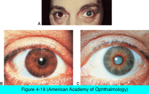
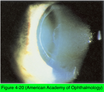

# 11.4.6. Pathology (VI): Other Secondary cataract

## Images

## Hierarchy

- Cataract Associated With Uveitis
  - chronic uveitis
    - associated corticosteroid therapy
  - PSC
  - +- anterior lens changes
  - posterior synechiae
  - thickening of the anterior lens capsule
  - fibrous pupillary membrane
  - +- calcium deposits on the anterior capsule or within the lens
  - Fuchs heterochromic uveitis
    - cortical cataract
      - ≤70%
    - posterior synechiae do not commonly occur
    - pupillary membrane is unlikely
    - long-term corticosteroid therapy is not indicated
    - cataract extraction has a favorable prognosis
      - intraoperative anterior chamber hemorrhages
        - 25%
- Cataracts Associated With Ocular Treatments
  - corticosteroid treatment
    - posterior subcapsular cataract
  - vitrectomy
    - transient opacities involving the posterior sutures
      - 60%-95%
      - soon after vitrectomy
      - usually resolve spontaneously
    - nuclear cataract
      - within 2 years
      - less common in patients <50 years
      - increases in oxygen tension in the vitreous intraoperatively and postoperatively
      - retinal surgery without vitrectomy is not associated with lens opacification
  - age-related degeneration of the vitreous body
    - increased risk of nuclear opacification
- Exfoliation Syndrome
  - systemic disease
    - LOXL1 mutation
    - matrix of fibrotic material is deposited in many bodily organs
  - basement membrane–like fibrillogranular white material
    - elastic microfibrils
    - deposited on
      - lens
      - cornea
      - iris
      - anterior hyaloid face
      - ciliary processes
      - zonular fibers
      - trabecular meshwork
    - grayish white flecks
      - prominent at the pupillary margin and on the lens capsule
  - unilateral or bilateral
  - more apparent with increasing age
    - rare <50 years
  - associated findings
    - atrophy of the iris at the pupillary margin
    - poorly dilating pupil
    - deposition of pigment on the anterior surface of the iris
    - increased pigmentation of the trabecular meshwork
    - capsular fragility
    - zonular weakness
      - spontaneous lens subluxation and phacodonesis
      - may affect cataract surgery technique and intraocular lens implantation
    - cataracts
      - exfoliative material may be elaborated even after lens is removed
      - abnormalities in transforming growth factor β (TGF-β)
        - increased oxidative stress
    - exfoliation glaucoma
      - open-angle glaucoma
      - fibrillar material obstructs flow through and causes damage to the trabecular meshwork or the uveoscleral pathway
      - odds of PXF leading to glaucoma
        - ≤40% over a 10-year period
      - in Scandinavian countries, PXF accounts for >50% of OAG
      - exfoliation glaucoma differs from POAG in
        - unilateral presentation
        - greater pigmentation of the trabecular meshwork
        - higher IOP
        - greater diurnal fluctuations
        - overall worse prognosis
      - laser trabeculoplasty
        - can be very effective
        - response in exfoliation glaucoma may not last as long as that in POAG
- Cataracts and Hyperbaric Oxygen Therapy
  - similar to vitrectomy
  - nuclear sclerosis
    - ≥150 hyperbaric oxygen therapies during a 1- year period
      - 50% nuclear cataracts
    - myopic shift
      - during the course of several weeks
      - resolves after cessation of therapy
    - increased vitreous oxygenation
- Cataract and Atopic Dermatitis
  - chronic, erythematous dermatitis
    - itching
  - history of multiple allergies or asthma
  - increased levels of immunoglobulin E (IgE)
  - Cataract
    - 25%
    - bilateral
    - second to third decade of life
    - anterior subcapsular opacities
      - resemble shieldlike plaques
- Cataract and Ischemia
  - etiology
    - pulseless disease (Takayasu arteritis)
    - thromboangiitis obliterans (Buerger disease)
    - anterior segment necrosis
  - PSC
    - may progress rapidly to total cataract
- Cataracts Associated With Degenerative Ocular Disorders
  - retinitis pigmentosa
  - essential iris atrophy
  - chronic hypotony
  - absolute glaucoma
