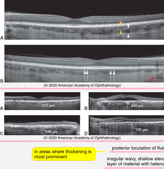
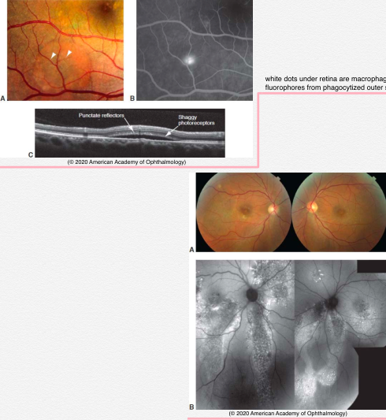
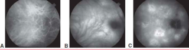
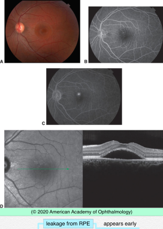
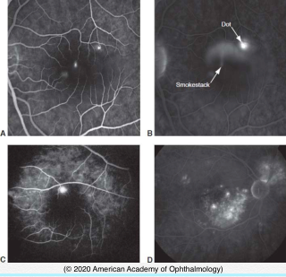

# 12.9.1. Central Serous Chorioretinopathy (CSC)

## Images

## Hierarchy

- BCSC 2020-2021
  - pathogenesis
    - hyperpermeability of choroid (choriocapillaris)
      - leakage at level of RPE
    - leakage into subretinal space
    - impaired fluid removal from subretinal space
  - demographics
    - healthy
    - 35-55 years
    - M>F
      - 3:1
    - no racial predilection
  - etiology
    - personality type
      - stress
      - tense driven personality (type A)
    - elevated levels of corticosteroids
      - endogenous hypercortisolism (Cushing syndrome)
      - corticosteroid administration
        - systemic
        - not intravitreal
    - systemic hypertension
    - sleep apnea
    - psychopharmacologic medications
    - pregnancy
  - other imaging modalities
    - OCT
      - neurosensory RD
      - EDI-OCT
        - thick choroid
        - posterior loculation of fluid in deep choroid irregular wavy, shallow elevation of the RPE by a layer of material with heterogeneous reflectivity
          - in areas where thickening is most prominent
      - CNV
    - fundus autofluorescence
      - accumulation of shed outer segments in subretinal space
        - white dots under retina are macrophages with fluorophores from phagocytized outer segments
      - focal hypoautofluorescence
        - RPE defects
      - descending tracts
        - chronic CSC
      - lower levels of central macular autofluorescence
        - poorer vision
    - indocyanine green angiography
      - choroidal vascular hyperpermeability
      - CNV
      - choroidal vascular abnormalities
        - venous dilation
          - filling delays in choroidal arteries & choriocapillaris
        - hyperpermeability of choroidal vessels
        - hyperfluorescent patches
          - multifocal
          - appear early
          - slowly enlarge during angiogram
          - less prominent in late views
        - washout pattern
          - unchanged during clinically inactive phases
      - helps to differentiate atypical diffuse CSC in older patients from
        - occult CNV
        - polypoidal choroidal vasculopathy
    - OCT angiography
      - detecting type 1 CNV
  - clinical
    - +- bilateral
      - aymmetric
    - symptoms
      - suggen onset
        - blurred vision
        - dim vision
        - micropsia
        - metamorphopsia
        - paracentral scotoma
        - decreased color vision
        - prolonged afterimages
    - visual acuity
      - 20/20-20/200
        - usually >20/30
      - improves with hyperopic correction
    - acute findings
      - serous detachment of sensory retina
        - round or oval
        - localized
          - often involves fovea
      - small whitish subretinal precipitates
      - serous RPE detachment
        - under superior half of serous retinal detachment
        - without serous retinal detachment
      - gray-white feather-edge subretinal material
        - fibrin
    - chronic findings
      - granular RPE pigmentation
      - widespread shallow detachment
      - photoreceptors atrophy
      - multiple small leaks on IVFA
      - RPE atrophic areas
        - evidence of prior episodes
        - run-off/guttering
        - pachychoroidal pigment retinopathy
          - thick choroid
          - RPE alterations
          - no serous retinal detachment
    - CNV
      - in ≤ 20% of patients >50 yr
        - even without laser
      - easy to detect with OCT angiography
      - in 2% of eyes treated with photocoagulation
      - in the immediate postoperative period in 2% of eyes after photocoagulation
  - differential diagnosis
    - type 1 CNV
      - OCT demonstrates an irregular wavy, shallow elevation of the RPE by a layer of material with heterogeneous reflectivity
      - FA findings overlap with CSC
    - polypoidal choroidal vasculopathy (PCV)
  - natural course
    - good visual prognosis except
      - chronic recurrent CSC
    - spontaneous resolution
      - 80-90%
        - bullous CSC
      - within 3-4 months
      - visual recovery within 1 year
      - residual symptoms
        - mild metamorphopsia
        - faint scotomata
        - abnormal contrast sensitivity
        - mild color vision defictits
        - permanent diminished visual acuity
    - recurrence
      - 40-50%
  - fluorescein angiography
    - leakage from RPE
      - appears early
    - patterns
      - dot form
        - expansile dot
          - +- multiple
            - most common
          - early phase of angiogram
            - focal leak through RPE
              - dot
          - late phase of angiogram
            - pooling of dye in subretinal space
            - 10-15 min
      - smokestack form
        - tree-shaped
        - uncommon
          - 10%
      - diffuse
        - extensive gravity-dependent serous retinal detachment
        - extensive RPE changes
        - without obvious leakage point
  - treatment
    - laser photocoagulation
      - more rapid resorption of subretinal fluid
        - 5 weeks vs 23 weeks
      - no improvement in final visual acuity
      - no effect on choroidal thickness
        - no decrease in recurrence rate
      - sub-threshold laser photocoagulation
    - photodynamic therapy with verteporfin
      - reduces or eliminates subretinal fluid
      - few complications
        - atrophy
          - 4%
      - recurrence after successful PDT is rare
      - decreases choroidal thickness and reduces choroidal vascular hyperpermeability
      - standard (600 mW/cm2) to reduced fluence (300 mW/cm2)
    - medical treatment
      - mineralocorticoid receptor antagonists
        - eplerenone
          - resolution of subretinal fluid in 25%
        - spironolactone
