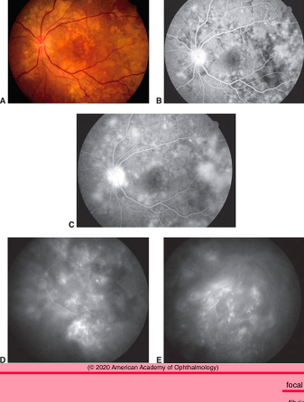
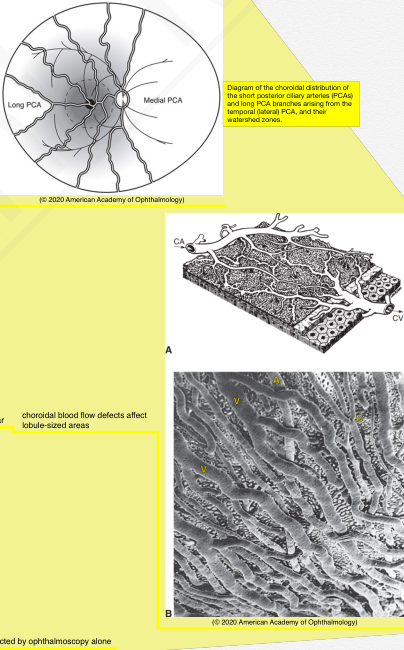
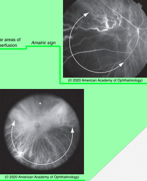
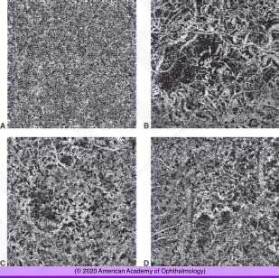
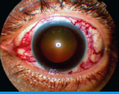

# 12.9.2. Choroidal Perfusion Abnormalities

## Images

## Hierarchy

- Nonarteritic Disease
  - emobolic
    - emboli from heart
    - corticosteroids
    - calcium hydroxyapatite injection
  - systemic disease
    - lupus anticoagulants
    - thrombotic thrombocytopenic purpura
      - fever
        - thrombocytopenia
          - microangiopathic hemolytic anemia
      - renal dysfunction
        - neurologic dysfunction
      - multifocal yellow placoid areas + serous retinal detachment
    - disseminated intravascular coagulation
      - ischemia from microthrombi
      - hemorrhage from multiple sites
  - severe hypertension
    - etiology
      - malignant hypertension
      - eclampsia
        - HELLP syndrome
          - hemolysis
          - elevated liver enzymes
          - low platelet count
    - pathogenesis
      - focal infarction of the choriocapillaris
      - fibrinoid necrosis of larger arterioles
    - clinical findings
      - retinal and optic nerve head abnormalities
      - areas of yellow placoid discoloration of the RPE
      - serous detachment of the retina
      - resolution
        - small focal infarction of the choriocapillaris
          - small patches of atrophy and pigmentary hyperplasia
            - Elschnig spots
        - infarction of an arteriole
          - linear aggregations of atrophic spots
            - Siegrist streaks
        - sector-shaped abnormalities
          - Amalric triangles
  - aging
    - older patients
    - histology
      - intimal hyperplasia
      - medial hypertrophy
        - decrease in the lumen size
          - low inflow pressure
            - areas of slow blood flow
              - choroidal watershed filling defects
                - segmental arrangement of choroid causes areas of severe decreased perfusion between areas of low perfusion
- Introduction
  - most of blood flow to the eye goes to choroid
  - blood supply of choroid
    - 20 short posterior ciliary arteries
      - blood flow through choroid is high compared with other tissues
      - oxygen content of choroidal venous blood is only 2%–3% lower than arterial blood
    - 2 anterior ciliary arteries
      - network of branching arterioles
  - choroidal arterial supply is segmental
    - Diagram of the choroidal distribution of the short posterior ciliary arteries (PCAs) and long PCA branches arising from the temporal (lateral) PCA, and their watershed zones.
  - choriocapillaris perfusion pattern is lobular
    - choroidal blood flow defects affect lobule-sized areas
  - flow defects in the choroid are often undetected by ophthalmoscopy alone
- BCSC 2020-2021
- Arteritic Disease
  - inflammatory occlusion can cause sectoral areas of nonperfusion
  - giant cell arteritis
    - occlusion of one or more short, posterior ciliary arteries
    - broad triangular areas of choroidal nonperfusion
      - Amalric sign
        - apex of triangle of nonperfusion points toward the occluded short posterior ciliary artery
  - granulomatosis with polyangiitis
- Choriocapillaris Blood Flow Abnormalities
  - choroidal blood flow defects affect lobule-sized areas of the choroid
  - acute posterior multifocal placoid pigment epitheliopathy
    - lesions are the putative size of a choroidal lobule
  - aging changes
    - choriocapillaris develops multiple areas of signal voids, consistent with decreased perfusion
    - increase in size and number with
      - age
      - hypertension
      - pseudodrusen
      - late age-related macular degeneration in the fellow eye
    - exhibit power law probability distributions
    - histologic studies show an increasing number of ghost vessels in the choriocapillaris, basal linear deposits, and subretinal drusenoid deposits with increasing age
    - OCT-A can show potential defects in capillary flow even within parts of a choroidal lobule
  - some diseases are associated with RPE atrophy in addition to geographic atrophy
    - diseases
      - pseudoxanthoma elasticum
        - can develop pseudodrusen
      - maternally inherited diabetes mellitus and deafness
    - exhibit remarkable loss of the choriocapillaris
      - even in the absence of RPE atrophy
- Increased Venous Pressure
  - etiology
    - dural arterial malformations
    - carotid cavernous fistulas
  - diagnosis
    - fluorescein and ICG angiography
    - stethoscope
      - to detect bruit
