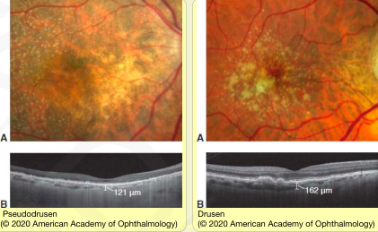
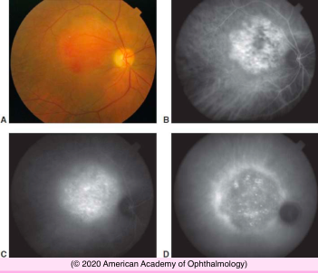
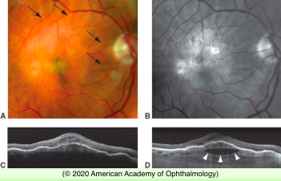
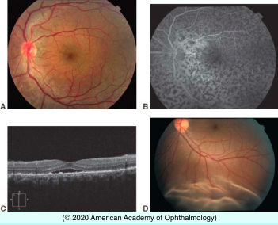
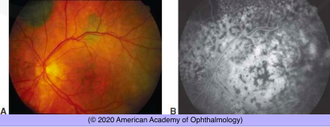

# 12.9.3. Other Choroidal Diseases

## Images

## Hierarchy

- BCSC 2020-2021
  - Age-Related Choroidal Atrophy
    - decreased choroidal thickness
      - myopia
      - increasing age
        - choroid is thinner in eyes with pseudodrusen than in those with drusen
    - pseudodrusen
      - eyes of elderly patients with thin choroid
      - collections of subretinal drusenoid deposits above the RPE
      - increased risk for
        - CNV
          - particularly types 2 and 3
        - geographic atrophy
          - .>90% of eyes with geographic atrophy also have pseudodrusen
  - Choroidal Hemangiomas
    - circumscribed
      - isolated
      - well-circumscribed
      - reddish-orange
      - varying thickness
      - transilluminate
      - ultrasound
        - highly echographic patterns
      - angiography
        - very early filling of large vessels
    - diffuse
      - Sturge-Weber syndrome
        - encephalofacial cavernous hemangiomatosis
        - ipsilateral facial nevus flammeus (port-wine stain)
      - may present first as glaucoma or amblyopia in children
      - tomato ketchup appearance
      - underlying choroidal markings are not visible
      - may blend imperceptibly into adjacent normal choroid
    - other features
      - retinal edema
      - neurosensory detachment
      - calcification and ossification in the choroid
      - hard exudate
    - treatment
      - laser photocoagulation
      - cryopexy
      - external-beam and plaque radiation
      - PDT (with verteporfin)
        - lowest risk of treatment-related morbidity
  - Choroidal Folds
    - external pressure
      - indenting tumor
      - thyroid eye disease
    - posterior scleritis
    - middle-aged adults, some of whom acquire an increased amount of hyperopia
      - bilaterally symmetric horizontal or oblique choroidal folds
    - Engorgement of the choroid
      - inflammation
        - inflammatory disease that causes scleral shortening and flattening of the posterior sclera
      - lymphoma
    - Reduced intraocular pressure
      - hypotony maculopathy
      - ciliochoroidal effusions
      - curvilinear choroidal folds in the posterior pole
    - Medications
      - topiramate
        - idiopathic swelling of the choroid with creation of chorioretinal folds and ciliochoroidal effusions without hypotony
    - Increased intracranial pressure
      - fine folds that course circumferentially around the optic nerve head
        - Patton lines
    - Localized choroidal folds
      - choroidal neoplasms
      - CNV
  - Bilateral Diffuse Uveal Melanocytic Proliferation
    - rare
    - paraneoplastic disorder
      - primary cancers
        - ovary
        - uterus
        - lung
          - most common
        - kidney
        - colon
        - pancreas
        - gallbladder
        - breast
        - esophagus
      - associated with or often heralds systemic cancer
    - clinical features
      - diffuse thickening of the choroid
      - reddish or brownish choroidal discoloration
      - serous retinal detachment
      - cataract
      - nummular loss of the RPE
        - hypoautofluorescent
        - hyperfluorescent during fluorescein angiography
      - large nevus-like regions of increased pigmentation
    - pathology
      - proliferation of benign melanocytes
    - OCT
      - mounds of residual material, presumed to be persistent RPE cells between areas of loss
  - Uveal Effusion Syndrome
    - pathogenesis
      - abnormal scleral composition or thickness
        - reduces transscleral aqueous outflow
    - clinical findings
      - choroidal and ciliary body thickening
        - can be imaged with ultrasonography
          - may be so thick that OCT imaging is not possible
      - exudative retinal detachment
      - RPE alterations
      - visual function may fluctuate
      - fluorescein angiography
        - leopard-spot pattern of hypofluorescence without focal leakage
    - treatment
      - scleral window surgery
      - intravitreal triamcinolone
      - visual results may be less satisfactory because of chronic, irreversible changes
    - differential diagnosis
      - high index of suspicion for uveal effusion syndrome should be maintained for young patients with hyperopia diagnosed as
        - RD
          - central serous chorioretinopathy
          - without visible retinal break
