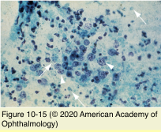
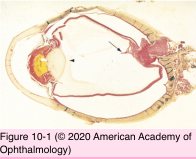
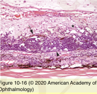

# 4.10.1. Vitreous (I)

## Images

## Hierarchy

- Inflammations
  - vitritis
    - benign or malignant white blood cells in vitreous cavity
    - infectious endophthalmitis
      - bacterial endophthalmitis
        - neutrophilic infiltration
        - vitreous liquefaction
          - posterior vitreous detachment
        - fibrocellular membrane formation
          - peripheral retinal traction
      - fungi
    - noninfectious endophthalmitis
      - chronic inflammatory cells
        - T & B lymphocytes
        - macrophages/histiocytes
- Topography
  - 4 ml
  - 99% water
  - macromolecules
    - glycosaminoglycans
      - types II & IV collagen
    - soluble proteins
      - BM: type IV collagen
        - Sclera: type I collagen
          - corneal stroma wound healing: type III collagen
    - glycoproteins
  - vitreous cortex
    - greater number of collagen fibrils
    - outer surface
      - hyaloid face
  - attachments
    - lens
      - hyaloideocapsular ligament
        - firm in young patients
    - vitreous base
      - 2-6 mm
    - internal limiting membrane
      - margins of optic nerve head
      - major retinal vessels
      - circular area around fovea
      - edges of areas of vitreoretinal degeneration
        - lattice degeneration
    - strongest uveoscleral attachments
      - major emissary channels
      - anterior base of ciliary body
      - juxtapapillary region
  - embryologic development
    - primary vitreous
      - fibrillar material
      - mesenchymal cells
      - vascular components
        - hyaloid artery
        - vasa hyaloidea propria
        - tunica vasculosa lentis
      - atrophies after formation of secondary vitreous
        - hyaloid canal "Cloquet canal"
        - Bergmeister papilla
        - Mittendorf dot
    - secondary vitreous
      - starts at 9th week of gestation
      - relatively acellular
        - hyalocytes
          - main portion of vitreous in adult eye
      - avascular
        - zonular fibers
    - tertiary vitreous
- Primary intraocular lymphoma (PIOL)
  - also known as
    - primary intraocular /central nervous system lymphoma
    - large cell lymphoma
    - vitreoretinal/retinal lymphoma
  - clinical findings
    - vitritis
    - sub-RPE infiltrates
      - neoplastic cells
      - overlying speckled pigmentation
    - retinal infiltration
    - optic nerve infiltration
    - perivascular
      - 1/2 have or develop CNS lymphoma
      - ischemic damage
  - histology
    - cytology
      - heterogeneous vitreous infiltrate
        - neoplastic cells
          - large B-cell lymphoma
          - convoluted nuclear membrane
          - multiple nucleoli
            - ghost cells
              - suggestive of PIOL
        - small lymphocyte infiltration
          - reactive T-cells
    - immunohistochemistry
      - monoclonal B-cell lymphocytes
    - flow cytometry
      - monoclonal B-cell lymphocytes
    - IL-10/IL-6 ratio>1
    - immunoglobulin gene rearrangement
    - PCR
    - subretinal/sub-RPE infiltrates
      - neoplastic lymphoid cells
      - cause RPE atrophy after resolution
    - secondary choroidal chronic inflammation
- Congenital anomalies
  - Persistent fetal vasculature
    - also known as
      - persistent hyperplastic primary vitreous
    - unilateral
    - clinical findings
      - retrolental fibrovascular plaque
        - adipose tissue
      - centripetal traction of ciliary processes
        - cartilage
        - elongated ciliary processes
      - persistent hyaloid artery
      - peripapilary tractional retinal detachment
      - cataract
      - microphthalmia
  - Bergmeister papilla
    - remnant of posterior portion of hayloid artery
    - veil-like structure
    - fingerlike projection
  - Mittendorf dot
    - focal lens opacity
      - inferonasal to lens center
      - remnant of anterior portion of hayloid artery
  - Peripapillary vascular loop
    - retinal vessels growing into Bergmeister papilla
  - Vitreous cysts
    - etiology
      - idiopathic
      - retinitis pigmentosa
      - uveitis
      - remnants of hyaloid system
    - histology
      - hyaloid remnants
