# 4.10.2. Vitreous (II): Degenerations

## Images

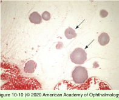

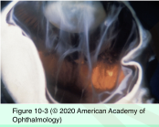

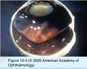

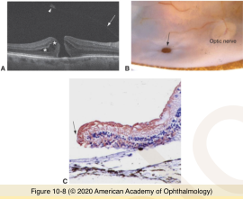

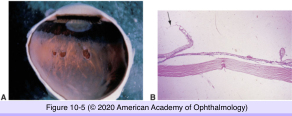

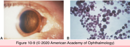

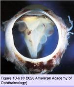

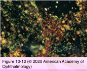

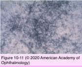

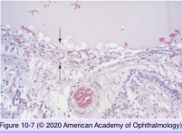

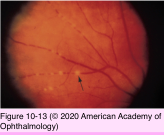

## Hierarchy

- Asteroid hyalosis
  - histology
    - round
      - 10-100 nm
        - alcian blue
    - staining
    - metachromasia
      - stains for neutral fat, phospholipids, calcium
      - birefringence
    - +- giant cell reaction
    - electron spectroscopic imaging
      - homogeneous distribution of ca, P, oxygen
        - similar to hydroxyapatite
    - immunofluorescence microscopy
      - chondroitin-6-sulfate
        - periphery of asteroid bodies
    - lectin-gold labeling
      - carbohydrates specific for hyaluronic acid
- Syneresis
  - liquefaction of the central vitreous gel
  - etiology
    - aging
    - inflammation
    - hemorrhage
    - pathologic myopia
  - histology
    - aggregation of collagen fibers around syneretic areas
  - contributes to posterior vitreous detachment
- Macular holes
  - pathogenesis
    - localized perifoveal/pericentral vitreous detachment
    - anterior traction on the foveola
  - stages
    - stage 0 (premacular hole)
      - loss of foveal depression
    - stage 1A
      - horizontal splitting /schisis
        - foveal pseudocyst
      - small yellow spot
    - stage 1B
      - horizontal splitting
        - break/disruption in outer fovea
      - yellow ring
    - stage 2
      - full-thickness hole
        - <400 μm
        - centric/eccentric
    - stage 3
      - partial PVD
        - detached from macula
        - attached to optic disc
      - full-thickness hole
        - .>400 μm
      - rim of elevated/thickened retina
        - loss of photoreceptor outer segments in adjacent detached retinal rim
        - cystoid macular edema in adjacent parafoveal retina
        - epiretinal membrane on surface of adjacent retina
          - Muller cells
          - fibrous astrocytes
          - fibroblasts with myoblastic differentiation
    - stage 4
      - complete PVD
      - fully developed hole
- Posterior vitreous detachment (PVD)
  - pathogenesis
    - dehiscence in vitreous cortex
    - fluid from syneretic cavity enters subhyaloid space
    - weakening of adherence of cortical vitreous to ILM
    - vitreous body collapses anteriorly
  - etiology
    - aging
    - inflammation
    - aphakia/pseudophakia
    - trauma
    - vitreoretinal disease
      - 65% at age 65
  - incidence
  - contributes to
    - retinal tear
    - retinal detachment
    - vitreous hemorrhage
    - macular hole formation
- Vitreous hemorrhage
  - blood clot lysis
    - 3-10 days
  - RBC breakdown
    - denatured hemoglobin inside RBC
      - Heinz bodies
    - loss of hemoglobin
      - ghost cells
        - block trabecular mesheork
          - ghost cell glaucoma
      - hemoglobin spherules in vitreous
      - hemoglobin --> hemosiderin
    - phagocytosis by macrophages
    - cholesterol refractile crystals
      - develop from RBC membranes
      - "synchesis scintillans"
      - surrounding giant cell reaction
- Rhegmatogenous retinal detachment
  - retinal tear
    - vitreous traction on retina
      - PVD
      - trauma
    - at site of greatest vitreoretinal adhesion
      - vitreous base
      - margin of lattice degeneration
    - histology
      - vitreous adhesion to flap
      - loss of photoreceptors under flap
  - retinal detachment
    - histology
      - degeneration of outer segments of photoreceptors
      - loss of photoreceptors
      - migration of Muller cells
      - proliferation/migration of RPE cells
      - small cystic spaces
        - macrocysts
  - proliferative vitreoretinopathy
    - cellular membrane formation over or under retina
      - proliferation of
        - RPE cells
        - glial cells
          - Muller cells
          - fibrous astrocytes
        - macrophages
        - fibroblasts
        - myofibroblasts
        - +- hyalocytes
      - growth factors/cytokines
      - integrins
- Vitreous amyloidosis
  - protein fibrils
    - nonbranching
    - variable length
    - diameter = 75-100 Ao
    - ß-pleated sheet
      - Congo red staining
      - birefringence in polarized light
  - source
    - transthyretin (prealbumin)
      - blood protein
        - crosses blood-retina barrier
          - RPE cells
          - retinal vessel walls
          - vitreous
  - familial amyloid polyneuropathy (FAP) types I & II
    - vitreous opacities
    - perivascular infiltrates
    - peripheral neuropathy
    - cardiomyopathy
    - carpal tunnel syndrome
