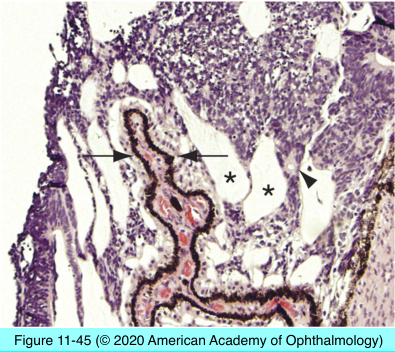

# 4.11.10. Retina & Retinal pigment epithelium (X): Neoplasia (II)

## Images

## Hierarchy

- Fuchs Adenoma
  - acquired tumor of nonpigmented ciliary body epithelium
  - may cause sectoral cataract
  - histology
    - hyperplastic nonpigmented ciliary epithelium
      - arranged in sheets and tubules
    - alternating areas of PAS-positive basement membrane material
- Combined hamartoma of the retina and retinal pigment epithelium
  - often diagnosed in childhood
  - slightly elevated variably pigmented mass
  - preretinal membrane
    - distorts the tumor inner retinal surface
  - histology
    - thickening of optic nerve head and peripapillary retina
    - increased number of vessels
    - hyperplastic RPE
      - perivascular
    - vitreous condensation and fibroglial proliferation
      - differentiates from RPE hyperplasia
- Medulloepithelioma (Diktyoma)
  - congenital neuroepithelial tumor
    - arises from primitive medullary epithelium
  - sites
    - ciliary body
      - most common
    - retina
    - optic nerve
  - clinical
    - non- or lightly pigmented cystic mass
    - ± iris/anterior chamber erosion
  - histology
    - undifferentiated round-oval cells with little cytoplasm
    - cell nuclei are stratified in 3-5 layers
    - ribbonlike structure with distinct cellular polarity
    - lined on one side by thin basement membrane
    - secretes mucinous substance rich in hyaluronic acid
      - resembles primitive vitreous
      - mucinous cysts
    - ± rosettes
      - Homer-Wright
      - Flexner-Wintersteiner
- Adenoma/Adenocarcinoma of RPE
  - uncommon
  - no history of prior trauma or eye disease
  - adenoma
    - retain characteristics of RPE cells
      - basement membrane
      - cell junctions
      - microvilli
  - adenocarcinoma
    - greater anaplasia
    - mitotic activity
    - retinal or choroidal invasion
    - does not metastasize
