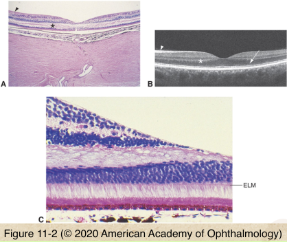
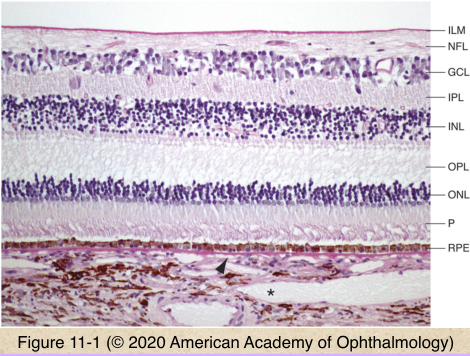

# 4.11.1. Retina & Retinal pigment Epithelium (I): Topography

## Images

## Hierarchy

- Embryology
  - neurosensory retina
    - from inner layer of optic cup
  - RPE
    - from outer layer of optic cup
      - neuroectoderm
- at ora
  - neurosensory retina
    - continuous with nonpigmented ciliary epiethlium
  - RPE
    - continuous with pigmented ciliary epiethlium
- Macula
  - definition
    - histologic
      - highest concentration of cones
        - ganglion cell layer>1 cell layer
    - clinical
      - area bound by temporal vascular arcades
  - subdivisions
    - foveola
      - only photoreceptors
    - fovea
      - 1.5 mm
        - contains only cones
    - parafovea
      - 0.5 m
    - perifovea
      - 1.5 mm
  - oblique outer plexiform layer (Henle)
    - flower-petal appearance of cystoid macular edema
    - star-shaped configuration of hard exudates
  - xanthophyll pigment
    - macula lutea
    - dissolves during tissue processing
- 9 layers of neurosensory retina
  - internal limiting membrane
    - true basement membrane
    - synthetized by Muller cells
  - nerve fiber layer
    - runs horizontally
      - feathery hemorrhages
  - ganglion cell layer
  - inner plexiform layer
  - inner nuclear layer
  - outer plexiform layer
  - outer nuclear layer
    - nuclei of photoreceptors
  - external limiting membrane
    - not true membrane
    - desmosomes between Muller cells and photoreceptors
  - photoreceptors
    - inner & outer segments of rods/cones
- RPE
  - anatomy
    - monolayer of hexagonal cells
      - taller, narrower, and more pigmented in macula
    - apical microvilli
    - basement membrane
    - cytoplasmic pigment
      - increases with aging
        - especially lipofuscin
  - functions
    - vitamin A metabolism
    - outer blood-retina barrier
    - phagocytosis of photoreceptor outer segments
    - light absorption
    - heat exchange
    - formation of basal lamina of inner portion of Bruch membrane
    - mucopolysaccharide matrix around photoreceptor outer segments
    - active transport of material into and out of subretinal space
- blood supply of neurosensory retina
  - retinal blood vessels
    - NFL
    - ganglion cell layer
    - inner plexiform layer
  - choroidal vasculature
    - outer 1/3 of inner nuclear layer
      - inner 2/3 of inner nuclear layer
    - outer plexiform layer
    - outer nuclear layer
    - photoreceptors
    - RPE
