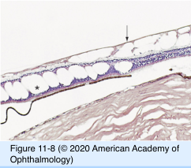
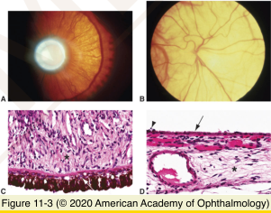
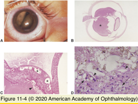
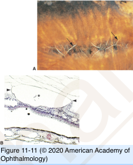
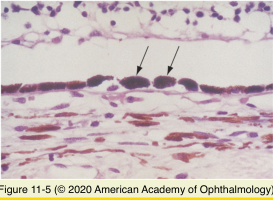
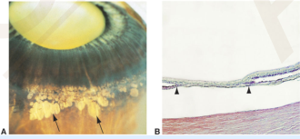

# 4.11.2. Retina & Retinal pigment Epithelium (II)

## Images

## Hierarchy

- outer plexiform layer
- Peripheral retinal degenerations
  - Peripheral cystoid degeneration
    - Typical peripheral cystoid degeneration
      - all eyes after age 20 years
      - causes typical degenerative retinoschisis
        - inferotemporal
    - Reticular peripheral cystoid degeneration
      - less common
      - nerve fiber layer
      - posterior to areas of typical peripheral cystoid degeneration
      - causes reticular degenerative retinoschisis
  - Lattice degeneration
    - demographics
      - 10% of general population
      - +- familial
        - 40% of rhegmatogenous retinal detachments
    - histology
      - ILM discontinuity
      - variable inner retinal atrophy
      - overlying pocket of liquefied vitreous
      - sclerosis of retinal vessels
        - patent
      - condensation & adherence of vitreous at margins of lattice
    - complications
      - atrophic holes
        - in the center of lattice
        - rare cause of RD
      - retinal tear
        - at margin of lattice
        - can cause RD
    - radial perivascular lattice degeneration
      - more posteriorly
      - along retinal vessels
  - Paving-stone (cobblestone) degeneration
    - clinical
      - peripheral retina
      - well-demarcated
      - flat
      - pale
    - histology
      - RPE atrophy
        - lattice degeneration causes inner retinal atrophy
      - outer retinal atrophy
      - adherence of inner nuclear layer to Bruch membrane
- Congenital Anomalies
  - Albinism
    - true albinism
      - oculocutaneous
        - autosomal recessive
        - X-linked recessive
          - decreased melanin in melanosomes
      - ocular
        - mild cutaneous albinism
          - decreased # of melanosomes
      - oligodendroglial cells
  - Myelinated nerve fibers
    - usually contiguous with the optic nerve head
    - scotoma if large
    - associated with
      - myopia
      - amblyopia
      - strabismus
      - nystagmus
  - Vascular anomalies
    - Coats disease
      - subretinal space
        - foamy macrophages
        - cholesterol crystals
  - Congenital hypertrophy of RPE
    - clinical
      - flat
      - dark black
      - few-10 mm
      - lacunae
        - enlarged (hypertrophic) RPE cells
          - hamartoma
    - histology
      - melanin granules
        - densely packed
        - spherical
          - large
      - rare adenoma/adenocarcinoma of RPE
    - differential diagnosis
      - familial adenomatous polyposis (Gardner syndrome)
        - hyperplasia of RPE
