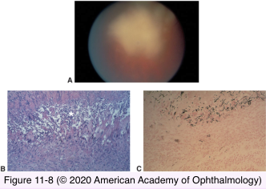
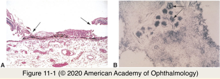
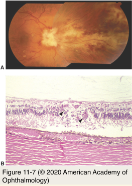
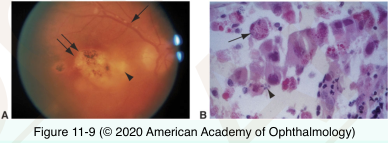

# 4.11.3. Retina & Retinal pigment Epithelium (III): Inflammations

## Images

## Hierarchy

- Fungal infections
  - immunocompromised patients
  - fungi causing retinal infection
    - candida
    - aspergillus
      - most common!
    - cryptococcus neoformans
  - histology
    - necrotizing granulomatous inflammation
      - central zone of necrosis
      - surrounding granulomatous inflammation
      - surrounding lymphocytic infiltration
    - GMS stain
      - fungal hyphae
- Viral infections
  - viruses causing retinal infection
    - rubella
    - measles
    - HIV
    - HSV
    - VZV
    - CMV
  - Acute retinal necrosis
    - rapidly progressive necrotizing retinitis
    - etiology
      - VZV
        - HSV types 1 & 2
      - CMV
        - rarely!
    - patient
      - healthy
      - immunocompromised
    - histology
      - obliterative retinal vasculitis
      - retinal necrosis
      - inflammation
        - vitreous
        - anterior chamber
      - electron microscopy
        - viral inclusions in retinal cells
      - PCR
        - vitreous
        - aqueous
  - CMV retinitis
    - immunocompromised patients
      - AIDS!
    - histology
      - infects
        - vascular endothelial cells
          - retinal hemorrhages
        - retinal neurons
          - large neurons
            - cytomegalo cells
              - 20-30 μm
            - large eosinophilic intranuclear/intracytoplasmic inclusion bodies
        - macrophages
      - full thickness retinal necrosis
        - thin fibroglial scar
- Toxoplasmosis
  - most common infectious retinitis
  - pathogenesis
    - reactivation of congenital toxoplasmosis
    - acquired toxoplasmosis
    - patient
      - healthy
      - immunocompromised
  - clinical
    - posterior uveitis/panuveitis
      - vitritis
    - focal retinochoroiditis
    - pigmented chorioretinal scar
      - reactivated disease
  - histology
    - toxoplasma organisms
      - tachyzoites
      - cysts
      - encystment after healing
    - retinal necrosis
    - infiltrate of neutrophils & lymphocytes
    - granulomatous inflammation of inner choroid
    - lymphocytic infiltrate of vitreous
