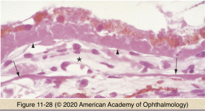
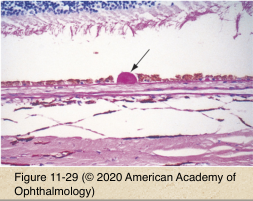
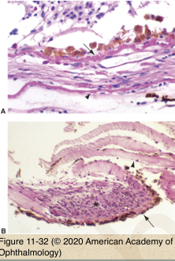
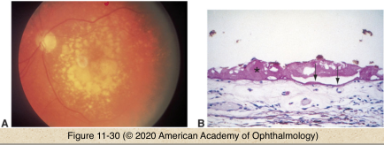
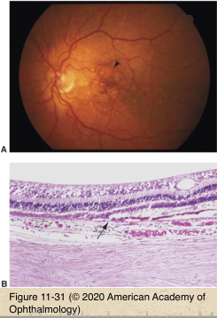

# 4.11.4. Retina & Retinal pigment Epithelium (IV): Age-Related Macular Degeneration

## Images

## Hierarchy

- etiology
  - genetic
    - leading cause of new blindness in US
    - single nucleotide polymorphisms in the complement factor H (CFH) gene
      - 60%
  - increasing age
    - smoking
  - positive family history
  - oxidative stress
    - cardiovascular disease
- histology
  - not clinically visible
    - electron microscopy
      - deposits between plasma membrane (basal lamina) of RPE and basement membrane of RPE
        - basal laminar deposits
      - deposits between basement membrane of RPE and elastic portion of Bruch membrane
        - basal linear deposits
    - light microscopy
      - confluent deposits may be visible on light microscopy
        - diffuse drusen
- Exudative AMD
  - choroidal neovascularization
    - between inner and outer Bruch membrane
    - beneath RPE
    - in subretinal space
    - types
      - type 1
        - basal laminar deposits/diffuse drusen
        - broad expanse disoriented/absent RPE
          - within Bruch membrane or in the sub-RPE space
        - characteristic of AMD
      - type 2
        - small RPE defect
          - subretinal space
        - more amenable to surgical excision
          - characteristic of ocular histoplasmosis
      - anatomical types of CNV
        - type 1
          - between Bruch membrane & RPE
          - usually occult
        - type 2
          - between neurosensory retina & RPE
          - usually classic
        - type 3
          - intraretinal
          - "retinal angiomatous proliferation"
    - histology
      - vascular channels
      - photoreceptor outer segments
      - basal linear/laminar deposits
      - hyperplastic RPE
      - inflammatory cells
  - macular edema
  - sub-/intra-retinal hemorrhage
- Nonexudative AMD
  - drusen
    - deposits between RPE and Bruch membrane
      - PAS-positive
    - classification
      - hard (hyaline)
        - discrete
        - hyaline material
      - soft
        - poorly demarcated
        - amorphous
          - .>63 micron
        - cleavage of RPE and basal laminar/linear deposits from Bruch membrane
      - basal laminar/cuticular
        - diffuse, small, regular, nodular deposits in macula
      - calcific drusen
        - sharply demarcated
        - glistening/refractile
        - RPE atrophy
  - photoreceptor atrophy
  - RPE atrophy
    - geographic atrophy
