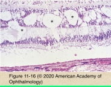
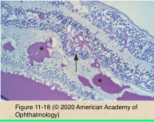
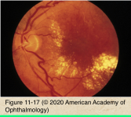
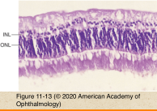
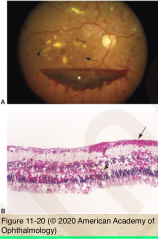
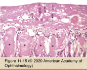
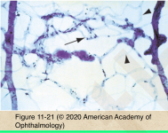
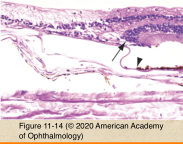
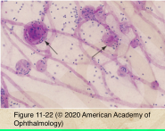
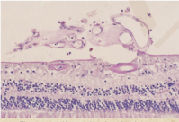

# 4.11.5. Retina & Retinal pigment Epithelium (V): Ischemia

## Images

## Hierarchy

- etiology
  - diabetes mellitus
  - retinal artery & vein occlusion
  - radiation retinopathy
  - retinopathy of prematurity
  - sickle cell retinopathy
  - vasculitis
  - carotid occlusive disease
- vascular response
  - vascular endothelial growth factor (VEGF)
    - increases vascular permeability
    - induces angiogenesis
    - VEGF inhibitors
      - pegaptanib
        - RNA aptamer
        - binds to VEGF165 isoform
      - ranibizumab
        - recombinant humanized monoclonal antibody fragment
      - bevacizumab
        - full length monoclonal antibody
          - inhibit all isoforms of VEGF-A
  - retinal edema
    - increased permeability of inner blood-retina barrier
  - hard exudates
    - intraretinal eosinophilic sharply demarcated deposits of lipid & protein
      - extracellular
      - within microglial cells
        - indicates chronic edema!
    - macular star
      - deposits in the outer plexiform layer (Henle layer) of macula
  - retinal hemorrhages
    - nerve fiber layer
      - flame-shaped
    - nuclear/inner plexiform layers
      - dot & blot
    - subhyaloid/sub-ILM
      - boat-shaped
    - white-centered hemorrhages
      - Roth spots
      - central aggregates of
        - WBC
        - platelets
        - fibrin
  - architectural vascular changes
    - area of infarction
      - acellular capillaries
    - adjacent areas
      - intraretinal microvascular abnormalities
      - microaneurysms
        - fusiform/saccular outpouchings of capillaries
          - PAS-stained trypsin digest preparations
  - neovascularization
    - etiology
      - diabetic retinopathy
      - central retinal vein occlusion
    - growth of new vessels on vitreous side of ILM
      - preretinal/vitreous hemorrhage
- cellular response
  - prolonged oxygen deprivation (>90 min)
    - rerinal infarction
      - neuronal cell degeneration
        - pyknosis
        - phagocytosis
        - +- proliferation of adjacent glial cells
          - neuronal cells do not regenerate
          - glial scar
      - glial cell degeneration
      - microglial cells
        - resistant to ischemia
        - tissue macrophages
          - phagocytose
            - necrotic cells
            - extracellular material
  - retinal circulation infarction
    - inner ischemic retinal atrophy
      - nerve fiber layer ischemic infarcts
        - cytoid bodies
          - swollen axons
            - accumulations of axoplasmic material
              - filled with proteinaceous fluid
          - cotton-wool spots
          - resolve in 4-12 weeks
            - area of inner retinal atrophy
  - choroidal circulation infarction
    - outer ischemic retinal atrophy
