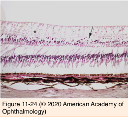
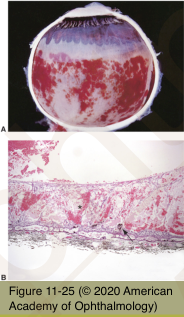

# 4.11.6. Retina & Retinal pigment Epithelium (VI): Retinal Vascular Occlusions

## Images

## Hierarchy

- Central retinal artery occlusion
  - etiology
    - localized arteriosclerosis
    - embolus
    - vasculitis
      - e.g. temporal arteritis
  - clinical
    - acute
      - inner retinal swelling & loss of transparency
        - cherry-red spot
    - chronic
      - inner retinal atrophy
  - complications
    - neovascularization
      - rare!
- not a risk factor for BRVO
- Branch retinal artery occlusion
  - embolus at arteriolar bifurcation
    - cholesterol embolus
      - Hollenhorst plaque
      - seldom causes occlusion
      - cardiac valvular disease
        - carotid vascular disease
    - calcific embolus
    - platelet-fibrin embolus
      - thromboembolism
  - histology
    - acute
      - inner retinal swelling
      - pyknotic nuclei
    - chronic
      - inner retinal ischemic atrophy
        - NFL
        - ganglion cell layer
        - inner plexiform layer
        - inner nuclear layer
- Central retinal vein occlusion
  - etiology
    - structural changes in central retinal artery and lamina cribrosa
      - hypertension
        - arteriosclerosis
      - hyperlipidemia
        - diabetes
      - glaucoma
      - central retinal vein compression
    - inflammation
      - papillophlebitis
        - clinical features of CRVO
        - no history of vascular disease
        - <50 years
    - etiology
      - systemic associations (Eye Disease Case- Control Study)
        - systemic arterial hypertension
        - diabetes mellitus
        - hyperlipidemia
      - elevated IOP or open-angle glaucoma
        - open angle glaucoma
      - increased intraorbital pressure
      - medications
        - oral contraceptives
  - clinical
    - retinal hemorrhages
      - 4 quadrants
        - diuretics
    - retinal vein dilation
    - optic disc edema
    - NFL infarcts
    - macular edema
  - 2 forms
    - nonperfused
      - more severe clinical findings
        - .>10 disc area nonperfusion
    - perfused
  - histology
    - retinal edema
    - acellular capillary beds
      - focal retinal necrosis
    - retinal hemorrhages
      - subretinal
      - intraretinal
      - preretinal
      - hemosiderosis
    - retinal microaneurysms
    - gliosis
    - retinal disorganization
    - collateral vessels at optic disc
    - iris neovascularization
- Branch retinal vein occlusion
  - risk factors
    - systemic arterial hypertension
    - increasing age
    - glaucoma
    - smoking
    - diabetes not an independent risk factor!
  - retinal venule compression at A-V crossing
    - common adventitial sheath
    - arteriosclerotic changes in arteriole
      - arteriosclerosis
      - hypertension
  - clinical features
    - retinal hemorrhages
    - NFL infarcts
    - macular edema
    - lipid exudates
    - retinal microaneurysms
    - dilated collateral vessels
    - retinal nonperfusion
    - pigmentary macular disturbance
    - subretinal fibrosis
    - epiretinal membrane
    - neovascularization unlikely
      - nonperfusion>5 disc areas
  - histology
    - similar to CRVO
