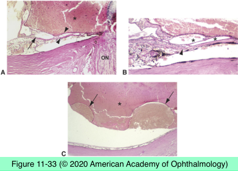
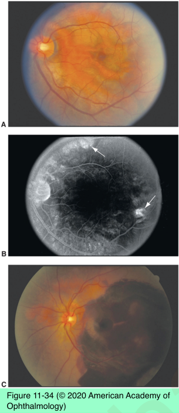
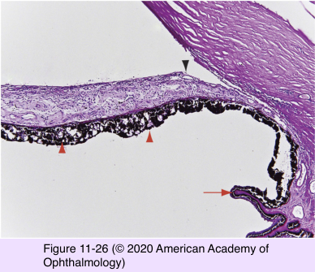
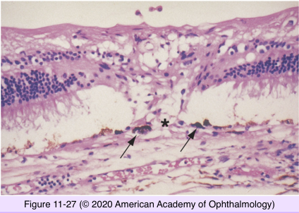

# 4.11.7. Retina & Retinal pigment Epithelium (VII)

## Images

## Hierarchy

- Polypoidal choroidal vasculopathy
  - dilated, thin-walled vascular channels
    - from short posterior ciliary arteries
      - penetrate into Bruch membrane
  - associated CNVM
- Diabetic retinopathy
  - leading cause of blindness among 20-60 year- olds
  - early physiologic changes
    - impaired autoregulation of retinal vessels
      - alteration in retinal blood flow
    - breakdown of blood-retina barrier
  - histology
    - thickening of basement membrane of retinal capillaries
    - microaneurysm formation
      - selective loss of pericytes of retinal capillaries
    - retinal capillary closure
    - intraretinal microvascular abnormalities
    - NFL infarcts (cotton-wool spots)
      - focal inner retinal ischemic atrophy
    - thick corneal epithelial basement membrane
      - inadequate adherence of epithelium to Bowman layer
    - lacy vacuolation of iris pigment epithelium
      - glycogen
        - PAS-positive
        - diastase-sensitive
      - thick basement membrane of pigmented ciliary epithelium
    - laser photocoagulation scar
      - outer retinal atrophy
        - glial scarring
      - RPE loss
        - proliferation of adjacent RPE cells
      - choriocapillaris occlusion
- Retinopathy of Prematurity
  - oxygen-induced peripheral retinal vasoconstriction
  - retinal vascular dilation
    - no retinal edema
    - plus or rush disease
  - neovascularization of retina/vitreous
    - at the border between vascularized and avascular peripheral retina
  - fibrovascular proliferation
  - tractional retinal detachment
  - macular heterotopia
  - high myopia
