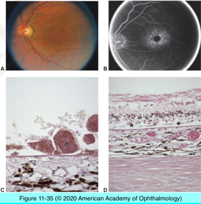
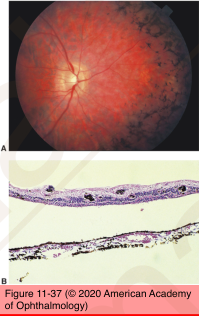
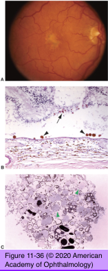

# 4.11.8. Retina & Retinal pigment epithelium (VIII): Dystrophies

## Images

## Hierarchy

- Fundus flavimaculatus/Stargardt disease
  - clinical
    - yellow flecks at level of RPE
    - generalized vermilion (reddish) fundus color
    - FA
      - dark choroid
      - bull's eye pattern
    - gradual decrease in vision
  - genetic
    - autosomal recessive>>autosomal dominant
    - mutations
      - ABCA4
        - most common
        - RIM protein
          - membrane of ATP-binding cassette transporter family
          - rims of rods & cones disc membranes
          - vitamin A transport to RPE
      - STGD4
      - ELOVA4
      - RDS/peripherin
  - histology
    - hypertrophic/engorged RPE cells
      - lipofuscin-like, PAS-positive material
      - apical displacement of RPE melanin granules
- chloride ion channels
- Best vitelliform dystrophy (Best disease)
  - genetic
    - autosomal dominant
    - VMD2 gene mutations
      - chromosome 11 (11q13)
      - bestrophin protein
        - basolateral RPE plasma membrane
        - involved in RPE cell volume regulation
  - clinical
    - vitelliform macular lesion
  - EOG
    - decreased ratio of light peak/dark trough
- Retinitis pigmentosa
  - genetics
    - sporadic
    - autosomal dominant
      - rhodopsin (RHO) gene
    - autosomal recessive
    - x-linked
  - clinical
    - bone spicule pigmentation
      - around retinal arterioles
    - arteriolar narrowing
    - optic disc atrophy
    - progressive visual field loss
  - histology
    - rod photoreceptor loss
      - apoptosis
    - secondary degeneratrion of cone photoreceptors
    - RPE hyperplasia
      - intraretinal migration around retinal vessels
    - thickening/hyalinization of retinal arterioles
    - optic disc atrophy/gliosis
- Pattern dystorphies
  - varying patterns of pigment deposition in the macula at RPE level
    - butterfly-shaped pattern dystrophy
    - adult-onset foveomacular vitelliform dystrophy
      - slightly elevated
      - symmetric
      - round to oval
      - yellow
      - dystrophic material between photoreceptors and RPE
    - reticular dystrophy
    - fundus pulverulentus
  - histology
    - central loss of RPE & photoreceptors
    - pigment-containing macrophages in subretinal space and outer retina
    - adjacent RPE distension with lipofuscin
    - basal lamina/liner deposits
      - RDS/peripherin gene
  - genetics
