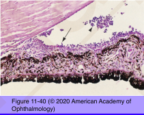
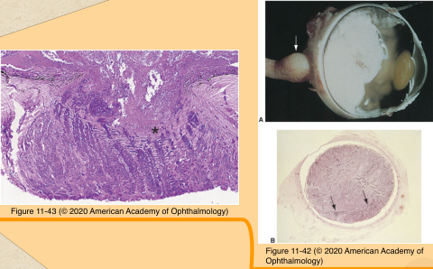
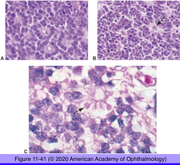
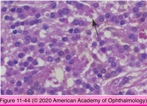
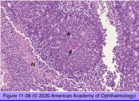
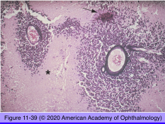

# 4.11.9. Retina & Retinal pigment epithelium (IX): Neoplasia (I): Retinoblastoma

## Images

## Hierarchy

- most common primary intraocular malignancy in childhood
  - 1:14,000-20,000
- pathogenesis
  - neuroblastic origin
    - positive staining for
      - neuron-specific enolase
      - rod outer segment photoreceptor-specific S antigen
      - rhodopsin
    - secret interphotoreceptor retinoid-binding protein
    - express red and green photopigment gene
    - express cone cell alpha subunits of transducin
    - cone cell lineage
  - genetics
    - retinoblastoma gene
      - long arm of chromosome 13
      - suppresses retinoblastoma
      - deletion/mutation of both homologous loci causes retinoblastoma
      - mutation in 1 gene may lead to mutation in the normal gene
- progression
  - optic nerve infiltration
    - brain extension
    - subarachnoid space seeding
    - poor prognostic sign
  - massive uveal invasion
    - increased risk of hematogenous dissemination
  - invasion of conjunctival substantia propria
    - risk of spread to regional lymph nodes
    - especially when trabecular meshwork is involved
- histology
  - retinoblastoma cells
    - round/oval/spindle-shaped nuclei
      - hyperchromatic
      - twice the size of a lymphocyte
      - high mitotic activity
    - imperceptible amount of cytoplasm
    - undifferentiated cells outnumber differentiated cells
      - not an important prognostic indicator
  - iris neovascularization
  - tumor seeding
    - vitreous
    - subretinal
  - Flexner-Wintersteiner rosettes
    - characteristic of retinoblastoma expect for
      - pinealoblatoma
      - ectopic intracranial retinoblastomas
    - expression of retinal differentiation
    - structure
      - central lumen
      - refractile lining
        - external limiting membrane
      - single row of cells
        - columnar
        - eosinophilic cytoplasm
        - peripherally located nuclei
        - looser chromatin compared to undifferentiated tumor cells
          - A. Flexner-Wintersteiner rosettes; B. Homer Wright rosette; C. Fleurette
  - Homer Wright rosette
    - found in
      - retinoblastoma
      - neuroblastoma
      - medulloblastoma of cerebellum
    - lumen filled with tangle of eosinophilic cytoplasmic processes
    - poorly differentiated
  - fleurette
    - curvilinear cluster of cells
      - rod inner segments
      - cone inner segments
      - abortive outer segments
    - expression of greater degree of retinal differentiation compared to F-W rosettes
  - pseudorosettes
    - viable cells around a blood vessel
    - ischemic necrosis starting 90-120 micron from the blood vessel
      - dystrophic calcification
      - DNA from necrotic cells detected within:
        - tumor vessels
        - iris vessels
- Retinocytoma/Retinoma
  - photoreceptor differentiation
    - fluerettes
  - differences with retinoblastoma
    - more cytoplasm
    - more evenly dispersed chromatin
    - no mitosis
    - no necrosis
      - +- calcification
