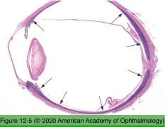
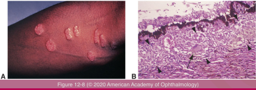
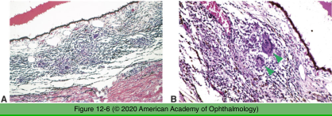
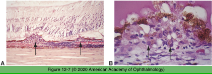
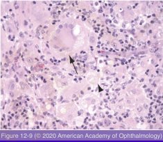

# 4.12.2. Uveal Tract (II): Inflammations

## Images

## Hierarchy

- Infectious inflammations
  - exogenous
  - endogenous
  - histology
    - mixed acute and chronic inflammatory infiltrate
    - granulomatous inflammation (epithelioid histiocytes)
      - viral
      - fungal
      - protozoal
- Sarcoidosis
  - uvea is the most common site of ocular involvement
    - uvea is the most common site of ocular involvement
    - clinical
      - iris nodules
        - at pupillary margin
          - Keoppe nodules
        - elsewhere on iris
          - Busacca nodules
      - chorioretinitis
      - periphlebitis
        - candlewax drippings
      - chorioretinal nodules
      - optic nerve inflammation
    - histology
      - sarcoid nodule
        - noncaseating granuloma
          - epithelioid histiocytes
          - ± multinucleated giant cells
            - star-shaped acidophilic bodies
              - asteroid bodies
                - Schaumann bodies
                  - not pathognomonic
            - spherical, basophilic, calcified bodies
          - cuff of lymphocytes
            - no central necrosis
              - noncaseating
      - granulomatous uveal inflammation
        - epithelioid histiocytes
        - lymphocytes
- Sympathetic ophthalmia
  - phases
    - trauma to 1 eye
      - exciting/inciting eye
    - latent period
      - 9 days - 50 years
    - uveitis in the other eye
      - sympathizing eye
  - histology
    - diffuse granulomatous inflammation
    - lymphocytes
    - epithelioid histiocytes
      - contain phagocytosed melanin pigment
    - scant plasma cells
    - AC inflammation
      - choriocapillaris spared
      - histiocyte deposits on corneal endothelium
        - mutton-fat KP
    - Dalen-Fuchs nodules
      - between RPE and Bruch membrane
        - lymphocytes
        - epithelioid histiocytes
      - not pathognomonic
        - VKH syndrome
- Juvenile xanthogranuloma
  - children
  - skin
  - uvea
    - iris
  - histology
    - lipid-laden (foamy) histiocytes
      - ring of nuclei surrounding a central homogeneous cytoplasm, while foamy cytoplasm surrounds the nuclei
    - Touton giant cells
    - lymphocytes
    - eosinophils
    - fragile blood vessels
      - spontaneous hyphema
- VKH syndrome
  - demographics
    - asian/native american ancestry
    - 30-50 yr
  - histology
    - diffuse chronic granulomatous uveitis
      - does not spare choriocapillaris
    - +- granulomatous retinal inflammation
    - RPE hyperplasia/atrophy
