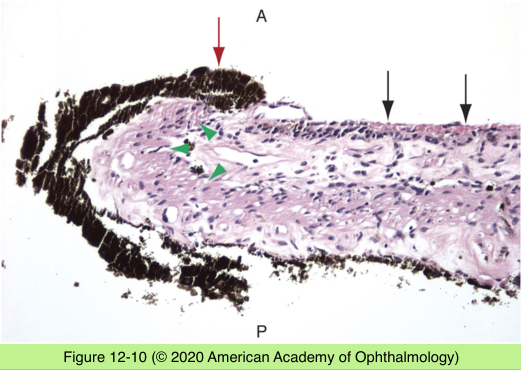

# 4.12.4. Uveal Tract (IV)

## Images

## Hierarchy

- Hyalinization of the Ciliary Body
  - normal aging process
  - histology
    - ciliary body processes
      - hyalinized and fibrosed
      - blunted and attenuated
    - stroma
      - loss of cellularity
      - more eosinophilic
  - contributes to presbyopia
- Iris neovascularization (rubeosis iridis)
  - histology
    - lack supporting fibrous cuff
    - fibrous membrane component
      - myofibroblasts
    - neovascularization of angle
      - peripheral anterior synechiae
        - neovascular glaucoma
    - ectropion uveae
    - flattened iris surface
    - atrophy of dilator muscle
    - attenuation of iris pigment epithelium
    - iris stromal fibrosis
  - etiology
    - CRVO
    - CRAO
    - BRVO
    - carotid occlusive disease
    - infectious/noninfectious uveitis
    - retinal detachment
    - Coats disease
    - secondary glaucoma
    - retinal detachment surgery
    - radiation
    - diabetes mellitus
    - sickle cell disease
    - retinoblastoma
    - uveal melanoma
    - metastatic carcinoma
    - trauma
- Trauma
  - Prolapse of uveal tissue
    - perforating injury
  - Rupture of choroid
    - blunt or penetrating injury
    - peripapillary semicircular lines
    - subretinal neovascularization
  - Chorioretinitis sclopetaria
    - rupture of both choroid and retina
  - Choroidal detachment
    - predisposing condition
      - traumatic globe rupture
      - surgery
    - serous/hemorrhagic
