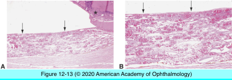
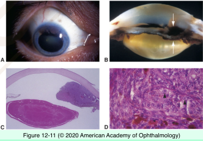
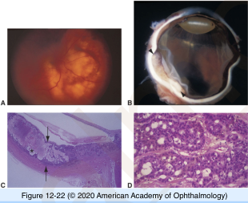
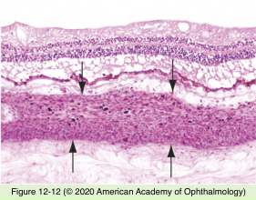
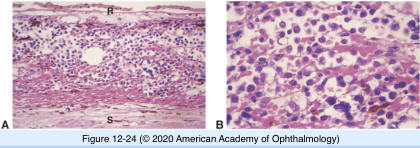

# 4.12.5. Uveal Tract (V): Neoplasia (I)

## Images

## Hierarchy

- Choroidal osteoma
  - demographics
    - adolescent-young adults
    - F>M
  - clinical
    - benign bony tumor
    - juxtapapillary location
    - yellow-orange
    - well-defined margins
  - histology
    - compact bone
    - bony trabeculae
      - osteocytes
      - cement lines
      - osteoclasts
    - intratrabecular spaces
      - loose connective tissue containing large and small blood vessels
      - vacuolated mesenchymal cells
      - scattered mast cells
- Iris Neoplasia
  - nevus
    - location
      - within stroma
      - on surface of iris
        - less common
      - +- angle involvement
    - cells
      - branching dendritic/spindle cells
        - melanin granules in cytoplasm
        - oblong/ovoid nuclei
          - indistinct nucleoli
      - epithelioid nevus cells
        - less common
      - no cellular atypia
      - no significant mitotic activity
  - melanoma
    - clinical
      - nonaggressive clinical course
        - rarely metastasize
      - +- vascularized
        - inferior iris
        - spontaneous hyphema
    - histology
      - cells
        - spindle melanoma cells
          - high nuclear-to-cytoplasmic ratio
          - plump spindle-shaped nuclei
            - coarse granular appearance
            - prominent nucleoli
            - spindle-B cells
        - epithelioid melanoma cells
          - polyhedral
          - large, round nuclei
            - clumped chromatin pattern
            - prominent eosinophilic nucleoli
          - high nuclear-to-cytoplasmic ratio
        - lightly to heavily pigmented
        - +- satellite lesions
        - +- diffuse growth pattern
          - higher rate of metastasis
- Hemangioma
  - 2 forms
    - localized (circumscribed)
      - no systemic associations
    - diffuse
      - Sturge-Weber syndrome
  - histology
    - variably sized vessels within choroid
      - capillary
      - cavernous
      - mixed
    - adjacent tissues
      - choroid
        - compressed melanocytes
      - RPE
        - hyperplasia
        - fibrous proliferation
- Metastatic tumors
  - multiple
    - most common (malignant) intraocular tumors in adults
  - bilateral
  - flattened growth pattern
  - most common primary cancers
    - breast in women
    - lung in men
- Nevus
  - <6% involve ciliary body
  - cells
    - plump polyhedral
      - abundant cytoplasm
        - filled with pigment
      - small, round-oval nucleus
        - bland appearance
    - slender spindle
      - scant pigment
      - small, dark, elongated nucleus
    - plump fusiform dendritic
      - intermediate between plump polyhedral and slender spindle
    - baloon cells
      - lacks pigment
        - abundant, foamy cytoplasm
      - bland nucleus
  - effect on adjacent tissues
    - choriocapillaris compression
    - overlying drusen
    - serous RPE detachment
    - serous retinal detachment
- Neural sheath tumors
  - Neurilemoma (schwannoma)
  - Neurofibroma
    - neurofibromatosis
  - rare
- Leiomyoma
  - histology
    - tightly packed slender spindle cells lacking pigment
    - smooth muscle antigens
    - mesectodermal leiomyoma
      - both myogenic & neurogenic features
  - rare
- Lymphoid proliferation
  - Uveal lymphoid infiltration
    - diffuse involvement of uveal tract
      - lymphocytes
        - polymorphic
        - low-grade
      - plasma cells
      - +- lymphoid follicles
    - (anterior &) posterior episcleral extension
  - Lymphoma
    - in association with systemic lymphoma
- Melanocytoma
  - magnocellular nevus
  - jet-black
  - anywhere in uveal tract
    - peripapillary most common
  - histology
    - plump polyhedral cells
      - abundant cytoplasm
      - small nuclei
      - heavily pigmented
    - +- cystic degeneration
    - +- necrosis
