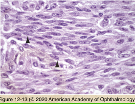
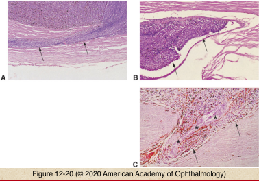
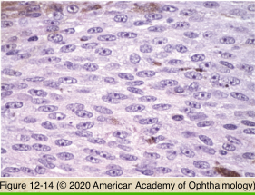
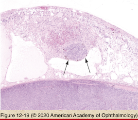
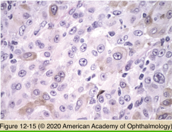
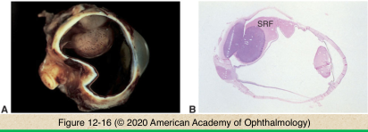
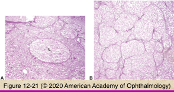
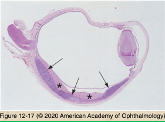
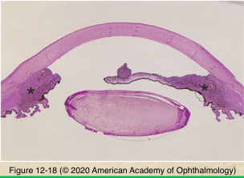

# 4.12.6. Uveal Tract (VI): Neoplasia (II): Ciliary Body & Choroidal Melanoma

## Images

## Hierarchy

- invasion of adjacent tissue
  - emissary channel invasion
  - scleral invastion
  - extraocular extension
  - retinal invasion
  - anterior chamber invasion
    - secondary glaucoma
- cell types
  - spindle
    - tumor consisting entirely of spindle-A cells is considered a nevus
      - most common primary intraocular malignancy in adults
    - spindle-A
    - spindle-B
      - more common
  - epithelioid
  - balloon cells
    - less common
- prognostic factors for survival
  - size of largest tumor dimension in contact with sclera
  - cell type
    - Callendar classification
      - spindle cell
        - best prognosis
      - epithelioid cell
        - worst prognosis
      - mixed cell
        - intermediate prognosis
          - totally necrotic melanomas assume the same prognosis as mixed-cell melanomas
    - mean of 10 largest melanoma cell nuclei
      - correlates with mortality
  - intrinsic tumor extravascular matrix pattern
    - more complex patterns increase risk of metastasis
      - closed loops
      - networks
  - growth pattern
    - diffuse choroidal melanomas
    - ring ciliary body melanomas
  - vascular closed loops/vascular networks
    - increased risk of metastasis
  - cytogenetics
    - monosomy of chromosome 3
    - trisomy of chromosome 8
    - mutations in gene coding for G protein alpha- subunit (GNAQ)
      - seen in 1/2 of uveal melanomas
    - increased risk of metastasis
  - extraocular extension
  - anterior (ciliary body) tumor location
  - juxtapapillary tumor location
  - tumor-infiltrating lymphocytes
- shape
  - dome
  - mushroom
    - Bruch membrane rupture
      - does not affect prognosis
  - diffuse
    - less common
    - ring melanoma in ciliary body
- metastasis
  - hematogenous
    - liver
      - liver metastasis is present in >95% of tumor- related deaths
      - sole site of metastasis in 1/3 of melanoma- related deaths
- other histologic features
  - low mitotic rate
  - variable cytoplasmic melanin content
  - variable tumor necrosis
    - melanin pigment release
      - melanomalytic glaucoma
  - pigment-laden macrophages
  - lymphocytic inflammatory infiltrate
  - serous retinal detachment
