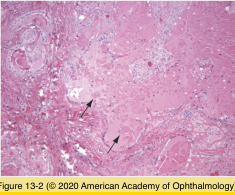
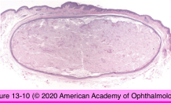
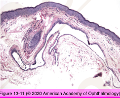
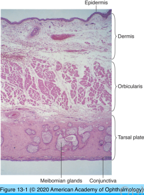

# 4.13.1. Eyelids (I)

## Images

## Hierarchy

- Congenital Anomalies
  - Distichiasis
    - aberrant formation of cilia in tarsus
      - exit through meibomian gland orifices
    - histology
      - hair follicles in tarsus
      - rudimentary tarsus
      - hypertrophic glands of Moll
  - Phakomatous choristoma
    - clinical
      - nodule
        - at birth
        - slow enlargement
        - inferonasal lower lid
    - histology
      - disorganized proliferation of lens epithelium
        - occasional "bladder cells"
          - undergo cytoplasmic enlargement
      - PAS-positive basement membrane material
      - eosinophilic material
        - lens nuclear/cortical proteins
  - Dermoid cyst
    - may occur in eyelid
- Topography
  - parts
    - orbital
    - tarsal
      - skin
        - anterior lamellae
      - orbicularis oculi
      - tarsus
      - palpebral conjunctiva
        - posterior lamellae
  - tissues
    - skin
      - keratinizing stratified squamous epithelium
        - melanocytes
        - Langerhans cells
      - loose collagenous connective tissue
        - cilia/associated sebaceous glands of Zeis
        - apocrine sweat glands (of Moll)
          - decapitation of apical portion
        - eccrine sweat glands
          - do not lose any part of the cell
        - pilosebaceous units
    - muscles
      - levator palpebrae superioris
        - eyelid elevation
      - Muller muscle
        - connects tarsus with levator
      - orbicularis oculi
    - tarsal plate
      - dense fibrous connective tissue
      - sebaceous meibomian glands
        - holocrine glands
          - shed the entire cell
    - accessory lacrimal glands
      - accessory lacrimal glands of Wolfring
        - upper border of superior tarsal plate
        - lower border of inferior tarsal plate
      - accessory lacrimal glands of Krause
        - in conjunctival fornices
    - palpebral conjunctiva
      - adherent to tarsus
  - dermatopathology terminology
    - acanthosis
      - thickening of stratum malpighii
        - stratum basale
        - stratum spinosum
        - stratum granulosum
    - hyperkeratosis
      - thickening of stratum corneum
    - parakeratosis
      - retention of nuclei within stratum corneum
      - absent stratum granulosum
    - dyskeratosis
      - premature individual cell keratizination within stratum malpighii
    - papillomatosis
      - fingerlike projections of epidermis lining fibrovascular cores
    - acantholysis
      - loss of cohesion between epithelial cells
    - spongiosis
      - widening of intercellular spaces between cells in stratum malpighii due to edema
  - Eyelid Glands
    - Conjunctival goblet cells
      - Diminished numbers in some dry eye states Mucoepidermoid carcinoma
      - Mucin secretion
    - Accessory lacrimal glands (of Krause & Wolfring)
      - Aqueous secretion (basal)
      - Sjogren syndrome Graft-vs-host disease Benign mixed tumor
    - Meibomian (sebaceous) glands
      - Lipid secretion
      - Chalazion Sebaceous carcinoma
    - Sebaceous glands of Zeis
      - Cilia lubrication
      - External hordeolum Sebaceous carcinoma
    - Apocrine glands of Moll
      - Cilia lubrication
      - Ductal cyst (apocrine hidrocystoma) Apocrine carcinoma
    - Eccrine glands
      - Temperature control, electrolyte balance
      - Ductal cyst (eccrine hidrocystoma) Syringoma Sweat gland carcinoma
- Cysts
  - Epidermoid/Dermoid cysts
    - Epidermoid cyst (Epidermal inclusion cyst)
      - lining
        - stratified squamous keratinizing epithelium
      - lumen
        - keratin
    - Dermoid cyst
      - skin adnexal structures
        - hair follicles
        - sebaceous glands
      - lumen
        - hair
        - sebum
        - keratin
  - Ductal cyst
    - lining
      - double layer of cuboidal epithelium
    - origin
      - sweat duct
        - apocrine hidrocytoma
        - eccrine hidrocystoma
      - lacrimal gland duct
        - dacryops
