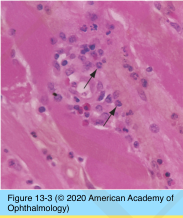
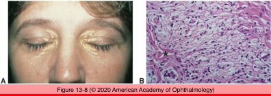
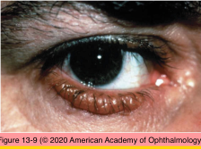
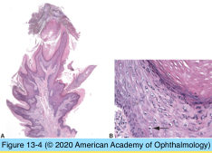
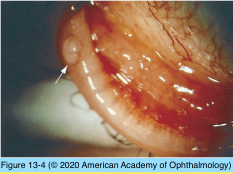
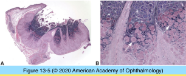
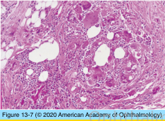

# 4.13.2. Eyelids (II)

## Images

## Hierarchy

- Degenerations
  - Xanthelasma
    - clinical
      - single or multiple
      - soft
      - yellow plaques
      - medial canthal region
    - hyperlipoproteinemia (types II & III)
      - 30-40%
    - histology
      - in dermis
        - foamy histiocytes
        - around blood vessels
  - Amyloid
    - extracellular proteins
      - ß-pleated sheath
        - congo red stain + polarized light
          - birefringence
          - dichroism
    - examples
      - Ig light chain fragments (AL amyloid)
        - plasma cell dyscrasia
      - transthyretin mutations
        - familial amyloid polyneuropathy (FAP) (types 1 & 2)
      - gelsolin mutations
        - FAP (type IV) (Meretoja syndrome)
          - lattice corneal dystrophy type II
    - eyelid skin
      - systemic disease
    - eyelid skin amyloidosis
      - elsewhere in ocular adnexa
        - localized disease
      - multiple, bilateral, symmetric, waxy yellow- white nodules
      - intradermal hemorrhage (purpura)
    - histology
      - amorphous eosinophilic extracellular material
        - within vessel walls
        - around peripheral nerves
        - around sweat glands
      - stains
        - congo red
        - crystal violet
        - thioflavin T
        - See Table 13-2
      - electron microscopy
        - randomly oriented extracellular fibrils
          - 7-10 nm
    - Eyelid manifestations of systemic disease
      - Erdheim-Chester disease
        - Xanthelasma, xanthogranuloma
      - Hyperlipoproteinemia
        - Xanthelasma
      - Amyloidosis
        - Waxy papules, ptosis, purpura
      - Sarcoidosis
        - Papules
      - Wegener granulomatosis
        - Edema, ptosis, lower lid retraction
      - Scleroderma
        - Reduced mobility, taut skin
      - Polyarteritis nodosa
        - Focal infarct
      - Systemic lupus erythematosus
        - Telangiectasis, edema
      - Dermatomyositis
        - Edema, erythema
      - Relapsing polychondritis
        - Papules
      - Carney complex
        - Myxoma
      - Fraser syndrome
        - autosomal recessive
        - Cryptophthalmos
        - partial syndactyly
        - genitourinary anomalies
      - Treacher Collins syndrome
        - Lower lid coloboma
        - downward palpebral fissure
        - mandibulofacial dysostosis (Treacher Collins– Franceschetti syndrome)
- Inflammations
  - Infectious
    - Hordeolum (stye)
      - glands of Zeis
      - meibomian glands
      - small abscess
        - neutrophils
        - necrotic debris
    - Cellulitis
      - preseptal cellulitis
        - anterior to orbital septum
        - bacterial infection
          - paranasal sinus infection
        - histology
          - neutrophilic infiltration
          - interstitial edema
          - +- necrosis
    - Viral infections
      - Verruca vulgaris (wart)
        - human papillomavirus
        - histology
          - hyperkeratosis
          - acanthosis
            - koilocytosis
              - cytoplasmic clearing (perinuclear halo)
          - papillary growth pattern
          - mixed inflammatory infiltrate in superficial dermis
      - Molluscum contagiosum
        - poxvirus
        - clinical
          - epidermal nodules
            - dome-shaped
            - waxy
            - central umbilication
          - secondary follicular conjunctivitis
        - histology
          - nodule of infected epidermis
            - central focus of necrotic cells
            - central crater
            - viral inclusions (molluscum bodies)
              - eosinophilic
              - become basophilic as they move to the surface
  - Noninfectious
    - Chalazion
      - lipid discharged into surrounding tissues
        - meibomian glands
        - glands of zeis
      - lipogranulomatous reaction
        - epithelioid histiocytes
        - multinucleated giant cells
        - central clear spaces (lipid dropout)
