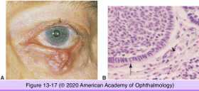
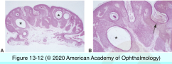
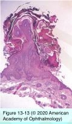
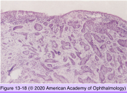
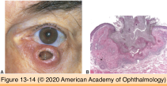
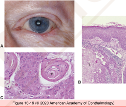
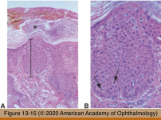
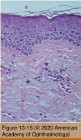
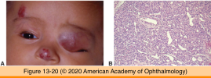

# 4.13.3. Eyelids (III): Neoplasia (I)

## Images

## Hierarchy

- Seborrheic keratosis
  - clinical
    - middle age
    - "stuck-on" papule
    - dome-shaped to verrucoid
    - pink to brown
  - systemic association
    - malignancy (gastrointesinal malignancy)
      - sudden onset of multiple seborrheic keratosis
        - Leser-Trelat sign
        - evolving acanthosis nigricans
  - histology
    - hyperkeratosis
    - acanthosis
      - proliferation of polygonal or basaloid squamous cells without dysplasia
    - papillomatosis
    - pseudohorn cysts
      - concentrically laminated collections of surface keratin in acanthotic epithelium
      - are in fact crevices/infoldings of surface epidermis
    - melanin phagocytosis by keratinocytes
      - brown color
    - inverted follicular keratosis (irritated seborrheic keratosis)
      - squamous eddies
        - nonkeratinizing squamous epithelial whorling
        - no pseudohorn cysts
      - clinically appear as cutaneous horn
  - Eyelid neoplasms in association with systemic malignancies
    - Muir-Torre syndrome
      - keratoacanthoma; sebaceous adenoma/ carcinoma
      - autosomal dominant; visceral (colon) carcinoma
    - Cowden disease
      - Multiple trichilemmomas
      - Autosomal dominant; fibrous hamartomas (breast, thyroid, GI); breast carcinoma
    - Basal cell nevus syndrome (Gorlin syndrome)
      - multiple basal cell carcinomas
      - autosomal dominant; medulloblastoma, fibrosarcoma
      - skeletal anomalies
        - mandible
        - maxilla
        - vertebrae
- Basal cell carcinoma
  - demographics
    - most common malignant neoplasm of eyelids
      - 90%
    - sites
      - lower lid
      - medial canthus
        - risk of orbital invasion
    - predisposing conditions
      - fair-skinned
      - blue-eyed
      - red-haired or blond
      - middle-aged and elderly persons
        - seen with increasing frequency in younger patients
      - English, Irish, Scottish, or Scandinavian ancestry
      - prolonged sun exposure during the first 2 decades of life
      - cigarette smoking
  - clinical
    - types
      - nodular type
        - elevated lesion
          - ulceration
          - pearly raised rolled edges
        - slowly enlarging
      - morpheaform
        - flat-slightly depressed pale yellow indurated plaque
        - infiltrative growth pattern
        - histology
          - no peripheral palisading
          - thin cords that radiate peripherally
          - surrounding stroma may show proliferation of connective tissue into a pattern of fibrosis
      - multicentric
    - local spread
      - pigmented
      - rarely metastasize
  - histology
    - originates from stratum basale/germinativum
      - only hair-bearing tissue
    - cohesive tumor cell islands
      - bland monomorphous nuclei + high N/C ratio
      - clear space surrounds the islands
        - nuclear palisading of peripheral cell layer
    - histologic patterns
      - keratotic (hair follicle)
      - squamous (metatypical)
      - sebaceous
      - adenoid
      - eccrine (syringoid)
      - morphea (sclerosing)
        - thin cords/strands in fibrotic stroma
  - treatment
    - complete excision with surgical margin control
- Keratoacanthoma
  - clinical
    - dome-shaped nodule
      - ≤ 2.5 cm
    - keratin-filled central crater
    - rapid growth
      - over weeks to months
    - spontaneous resolution
      - over several months
        - depressed scar
  - histology
    - cup-shaped proliferation of well-differentiated squamous cells
      - variant of well-differentiated squamous cell carcinoma
      - irregularly configured nests/strands
      - chronic inflammatory response
    - undermine adjacent normal epidermis
    - deep aspect
      - +- mitotic activity
      - +- nuclear atypia
    - if definite invasion, lesion should be considered a well-differentiated keratinizing squamous cell carcinoma
  - treatment
- Squamous cell carcinoma
  - demographics
    - 10-40 x less common than BCC
    - solar damaged skin
      - lower lid>upper lid
      - proportion of upper lid SCC>proportion of upper lid BCC
  - clinical
    - diverse appearance
      - ulcer
      - plaque
      - fungating
      - nodular
    - regional lymph node metastasis
      - 20%
  - histology
    - atypical squamous cells
      - extend beyond basement membrane
        - fibrotic reaction in dermis
      - variable differentiation
        - well-differentiated
          - keratin formation
        - moderately differentiated
        - poorly differentiated
      - intercellular bridges
    - perineural invasion
  - treatment
    - complete excision with surgical margin control
- lymphatic invasion
- Actinic keratosis
  - clinical
    - erythematous scaly macules/papules
      - few mm to 1 cm
    - hyperkeratotic type
      - cutaneous horn
    - hyperpigmented type
      - simulates lentigo maligna
    - middle age
    - sun-exposed skin
    - precancerous
      - squamous cell carcinoma
        - 0.5-3% metastasis
  - histology
    - epidermis
      - hyperkeratosis
      - parakeratosis
      - dyskeratosis
      - mitotic figures
      - cellular atypia
    - dermis
      - solar elastosis of underlying dermis
        - fragmentation/clumping/loss of eosinophilia of dermal collagen
      - chronic inflammatory infiltrate
  - treatment
    - shave biopsy not including the base is contraindicated!
- Capillary neoplasm
  - appear at/shortly after birth
  - bright red
  - grow over weeks to months
  - involute by school age
  - treat if interfere with vision (amblyopia)
    - ptosis
    - astigmatism
  - histology
    - early lesions
      - very cellular
        - solid nests of plump endothelial cells
      - little vascular luminal formation
    - established lesions
      - well-developed flattened endothelium-lined capillary channels
    - involuting lesions
      - increased fibrosis
      - hyalinization of capillary walls
      - luminal occlusion
